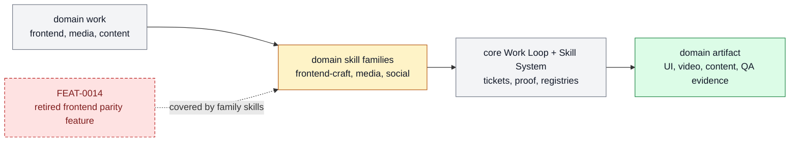

# Domain Skill Families

The specialized skill families for frontend, media, content, and future vertical
workflows that build on the core Work Loop and Skill System. This page is the product-
layer owner for that subsystem: it explains what belongs here, which feature specs make
up the stack, and where adjacent responsibilities should move.

```text
domain_skill_families(change, repo_state?) -> owned_feature_set + boundary_decision + maintenance_signal
```

## At A Glance

- System ID: `SYS-0010`
- Status: `implemented`
- Primary feature: `FEAT-0014`
- Owner spec: `docs/systems/domain-skill-families.md`
- Feature count: `1`

## Role

Domain Skill Families owns specialized product workflows that sit on top of the core
loop, such as frontend, media, content, and future vertical capability stacks.

## Feature Docs

- [FEAT-0014 Frontend skill parity upgrade](../features/FEAT-0014-frontend-skill-parity-upgrade.md)

## What Belongs Here

Domain-specific skill families, parity upgrades, workflow-specific QA, and specialized
delegation or proof practices that are reusable across projects.

## What Belongs Elsewhere

Core skill packaging belongs in Skill System; agent policy belongs in Agent Kernel; one-
off app implementation details belong in project tickets or app docs.

## Operating Contract

- Domain families build on the core Work Loop and Skill System instead of bypassing them.
- Each family owns its skill boundaries, QA proof, and public-facing guidance.
- New vertical families earn a system or feature owner only when repeated use proves value.
- Domain docs should describe usable workflows, not marketing for the skill itself.
- Feature-level behavior belongs in `docs/features/FEAT-*.md`; this page owns the system boundary and feature grouping.
- Registry data is generated from system and feature docs, not edited by hand.
- When a capability no longer deserves a feature page, fold its current truth into the best owner and remove active refs.

## System Flow



Domain Skill Families package specialized workflows on top of the same ticket, skill, and proof substrate.

## Surfaces

- `skills/frontend-craft/SKILL.md`
- `skills/frontend-design/SKILL.md`
- `skills/visual-design/SKILL.md`
- `skills/delegate-frontend/SKILL.md`

## Proof And Maintenance

- Registry proof: `python3 docs/features/validate_features.py`.
- Link proof: `python3 bin/validators/check_doc_refs.py`.
- Update this system page when product-layer boundaries or feature membership changes.
- Update feature pages when capability behavior changes.
- Regenerate registries and commit generated outputs with the source docs.

## Change History

- 2026-06-27: Migrated into the reader-first system-spec shape.
