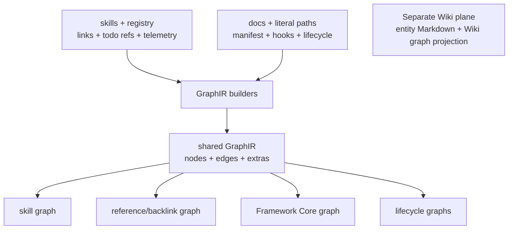

# Graph Systems

Graph Systems owns Farplane's harness graph vocabulary and GraphIR projection
toolkit. It turns repository declarations and references into inspectable
skill, backlink, Framework Core, and lifecycle graphs.

```text
harness_graph(repository_sources, projection_profile)
  -> GraphIR(nodes, edges, extras) + consumer_projection
```

## At A Glance

- System ID: `SYS-0013`
- Status: `implemented`
- Primary feature: `FEAT-0078`
- Owner spec: `docs/systems/graph-systems.md`
- Feature count: `1`

## Feature Docs

- [FEAT-0078 Harness GraphIR projections](../features/FEAT-0078-harness-graphir-projections.md)

## Graph Vocabulary

Farplane uses a common model across graph-shaped outputs: explicit sources
produce nodes, evidence-bearing edges, and consumer projections. The source
owner defines what an edge means; neither visualization nor storage may erase
that meaning.

| Term | Meaning |
| --- | --- |
| `GraphIR` | Shared harness-graph node, edge, bundle, validation, and projection toolkit |
| `Skill graph` | Skill registry relationships, todo order, common chains, and usage signals |
| `Harness reference graph` | Repo-wide local-reference graph used for backlinks and documentation audit |
| `Framework Core graph` | Manifest-selected operator map of core framework sources and workflows |
| `Lifecycle graph` | Semantic graph of skills, files, hooks, routes, reports, states, and lifecycle projections |
| `Wiki graph` | Project entity graph generated by [Wiki](wiki.md), not by GraphIR |
| `Scout Brief` | Feed Scout's capped planning-context synthesis; not Wiki graph and not a graph projection |

## Boundary With Wiki

[Wiki](wiki.md) owns Entity Markdown, identity resolution, article links,
source-page edge claims, and graph, CRM, and typed-view projections. Those
outputs share the broad node-edge-projection mental model but not the GraphIR
schema or engine.

| Wiki entity graph | Harness GraphIR |
| --- | --- |
| People, companies, topics, sources, claims, and evidence | Skills, files, hooks, routes, and states |
| Canonical entity articles and view configuration | Registries, references, manifests, signatures, and curated maps |
| Questions, timelines, locations, funnels, resources | Reference types, confidence, heat, file paths, and FSA state |
| Durable Markdown with generated search and consumer views | Generated inspection and navigation graphs |

The engines stay separate because they validate different source truth. Shared
low-level helpers may be adopted only when representative proof shows they
preserve both contracts; one universal graph schema is not a goal.

## Skill References And Backlinks

Skills participate in three authored graph relationship classes:

```text
SKILL.md + registry row
  -> markdown-ref edges
   + ordered todo-chain edges
   + common-chain edges
   + invocation/composition signals
```

Incoming references and top referrers are derived by reversing generated
outgoing edges. A reference edge means “this source points here”; it does not
by itself prove runtime execution. Todo-chain and curated lifecycle edges carry
their own explicitly labeled semantics.

## Operating Contract

- Authored repository declarations remain canonical; generated harness graphs
  are replaceable projections.
- Every edge preserves source evidence, relationship kind, and confidence
  rather than collapsing to a generic “related” edge.
- Reference edges are navigation evidence, not automatic execution order.
- New harness graph products reuse GraphIR and add a named projection profile
  only when a representative consumer case proves it necessary.
- Wiki relationship semantics stay with Wiki; GraphIR does not become a second
  entity engine.

## System Flow



## Surfaces

- `docs/features/FEAT-0078-harness-graphir-projections.md`
- `docs/farplane-framework/graph-contract.md`
- `docs/farplane-framework/harness-maintenance.md`
- `skills/skill-maintenance/graph/README.md`
- `skills/skill-maintenance/scripts/graph_ir.py`
- `skills/skill-maintenance/scripts/graph_projection.py`
- `skills/skill-maintenance/scripts/graph_projection_config.py`
- `skills/skill-maintenance/scripts/generate_skill_graph.py`
- `skills/skill-maintenance/scripts/generate_harness_graph.py`
- `skills/skill-maintenance/scripts/generate_farplane_lifecycle_graph.py`

## Proof And Maintenance

- `python3 skills/skill-maintenance/scripts/test_generate_skill_graph.py`
- `python3 skills/skill-maintenance/scripts/test_generate_harness_graph.py`
- `python3 skills/skill-maintenance/scripts/test_generate_farplane_lifecycle_graph.py`
- `python3 docs/features/validate_features.py`
- `python3 bin/validators/check_doc_refs.py`
- Update this system when GraphIR primitives, projection profiles, harness edge
  semantics, or the Wiki/Graph boundary changes.

## Change History

- 2026-08-19: Moved canonical entity authoring, resolution, and entity
  projections to Wiki; retained harness GraphIR and cross-projection vocabulary.
- 2026-07-31: Created the original system owner for entity and harness graph
  families.
