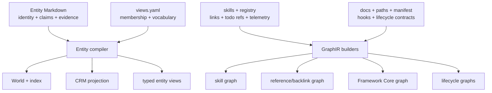

# Graph Systems

Graph Systems owns Farplane's graph vocabulary, engine boundaries, and
projection inventory. Farplane uses one common mental model—sources become
nodes, edges, evidence, and consumer projections—but has two implementation
planes because it graphs two different kinds of truth.

```text
graph_system(source, plane, projection)
  -> nodes + edges + evidence + consumer_view
```

## At A Glance

- System ID: `SYS-0013`
- Status: `implemented`
- Primary feature: `FEAT-0075`
- Owner spec: `docs/systems/graph-systems.md`
- Feature count: `4`

## The Two Graph Planes

| Plane | Canonical input | Engine | Outputs | Purpose |
| --- | --- | --- | --- | --- |
| Entity knowledge | `.farplane/entities/*.md` plus `.farplane/views.yaml` | `bin/core/farplane_entities.py` | `index.json`, `world.json`, `crm.json`, typed view JSON | Durable project-world identity, facts, evidence, relationships, and domain views |
| Harness knowledge | Skills, registries, Markdown/path refs, manifests, hooks, signatures, and curated lifecycle maps | shared GraphIR toolkit plus graph-family builders | skill, backlink/reference, Framework Core, and lifecycle graphs | Inspect and navigate how Farplane itself is connected |

They work alike at the structural level but not at the semantic level. Entity
knowledge needs claims, questions, timelines, locations, funnels, units,
observations, and transfers. Harness graphs need file paths, reference types,
confidence, todo order, usage heat, hooks, routes, and finite-state
projections.

The engines remain separate because each validates and preserves its own source
truth. A future refactor may share additional low-level node, edge,
serialization, or validation helpers, but no current proof shows that one
universal graph schema would reduce more complexity than it creates.

## Feature Docs

- [FEAT-0075 Entity Markdown and World projection](../features/FEAT-0075-entity-markdown-and-world-projection.md)
- [FEAT-0076 Typed entity view projections](../features/FEAT-0076-typed-entity-view-projections.md)
- [FEAT-0077 CRM entity projection](../features/FEAT-0077-crm-entity-projection.md)
- [FEAT-0078 Harness GraphIR projections](../features/FEAT-0078-harness-graphir-projections.md)

## Canonical Terms

| Term | Meaning |
| --- | --- |
| `Entity Markdown` | Canonical human-authored project entities and durable context |
| `Entity index` | Generated full-record/search projection |
| `World` | Generic project-qualified entity graph in `world.json` |
| `Typed view` | Domain interpretation compiled from named membership, view schema, and inline evidence tags |
| `CRM` | Funnel-bearing projection of canonical entities |
| `GraphIR` | Shared harness-graph node/edge/bundle toolkit |
| `Skill graph` | Skill registry relationships, todo order, common chains, and usage signals |
| `Harness reference graph` | Repo-wide local-reference graph used for backlinks and documentation audit |
| `Framework Core graph` | Manifest-selected operator map of core framework sources and workflows |
| `Lifecycle graph` | Semantic graph of skills, files, hooks, routes, reports, states, and lifecycle projections |
| `World Memory` | Feed Scout's capped planning-context synthesis; not Entity World and not a graph projection |

## Skill References And Backlinks

Skills already participate in graph relationships:

```text
SKILL.md + registry row
  -> markdown-ref edges
   + ordered todo-chain edges
   + common-chain edges
   + invocation/composition signals
```

The skill graph authors outgoing relationships. Incoming references and top
referrers are derived from those edges, which provides skill backlinks without
maintaining a second list.

The harness reference graph scans local Markdown links and literal repo paths
across the repository. Reversing those edges provides file and documentation
backlinks. A reference edge means “this source points here”; it does not by
itself mean runtime execution. Todo-chain edges and curated lifecycle edges
carry different, explicitly labeled semantics.

## What Belongs Here

- The inventory and terminology for Farplane graph families.
- The boundary between entity knowledge and harness GraphIR.
- Feature ownership for World, typed views, CRM, skill/reference graphs, and
  lifecycle projections.
- Cross-feature rules such as canonical source versus disposable projection.

## What Belongs Elsewhere

- Exact Entity Markdown syntax belongs in
  [Entity Markdown Authoring](../farplane-framework/entity-markdown-authoring.md).
- Entity compiler and projection schemas belong in
  [Entity Memory](../farplane-framework/entities.md).
- Typed observation and transfer semantics belong in
  [Entity View Projection Standard](../farplane-framework/entity-view-projection-standard.md).
- Lifecycle node, edge, confidence, and FSA contracts belong in
  [Graph Contract](../farplane-framework/graph-contract.md).
- Graph generation commands and maintenance internals belong in
  [Harness Maintenance](../farplane-framework/harness-maintenance.md).
- Farplane UI domain products and visual interactions belong to Farplane UI.
- Feed Scout World Memory belongs to Source And Sidecar Systems.

## Operating Contract

- Authored source remains canonical; generated graphs are replaceable
  projections.
- Every edge type preserves its evidence and semantics instead of collapsing
  all links into generic “related” edges.
- Projections may select, enrich, or aggregate source truth but do not silently
  become new canonical stores.
- Consumers must not treat reference edges as execution, observations as
  transfers, funnel state as campaign state, or questions as default World
  nodes.
- New graph products reuse the appropriate plane first and add a domain adapter
  only when a representative case proves the generic projection is
  insufficient.

## System Flow



Both planes compile explicit sources into inspectable projections. They do not
share canonical records or one universal schema.

## Surfaces

- `docs/features/FEAT-0075-entity-markdown-and-world-projection.md`
- `docs/features/FEAT-0076-typed-entity-view-projections.md`
- `docs/features/FEAT-0077-crm-entity-projection.md`
- `docs/features/FEAT-0078-harness-graphir-projections.md`
- `docs/farplane-framework/entity-markdown-authoring.md`
- `docs/farplane-framework/entities.md`
- `docs/farplane-framework/entity-view-projection-standard.md`
- `docs/farplane-framework/graph-contract.md`
- `docs/farplane-framework/harness-maintenance.md`
- `bin/core/farplane_entities.py`
- `skills/skill-maintenance/scripts/graph_ir.py`

## Proof And Maintenance

- Entity proof: `python3 -m unittest bin/tests/test_farplane_entities.py`.
- Harness graph proof: focused `test_generate_*graph.py` suites under
  `skills/skill-maintenance/scripts/`.
- Registry proof: `python3 docs/features/validate_features.py`.
- Link proof: `python3 bin/validators/check_doc_refs.py`.
- Update this system when a graph family, canonical input, engine boundary, or
  feature membership changes.

## Change History

- 2026-07-31: Created the system owner for entity and harness graph families,
  including skill backlink semantics and the two-engine boundary.
