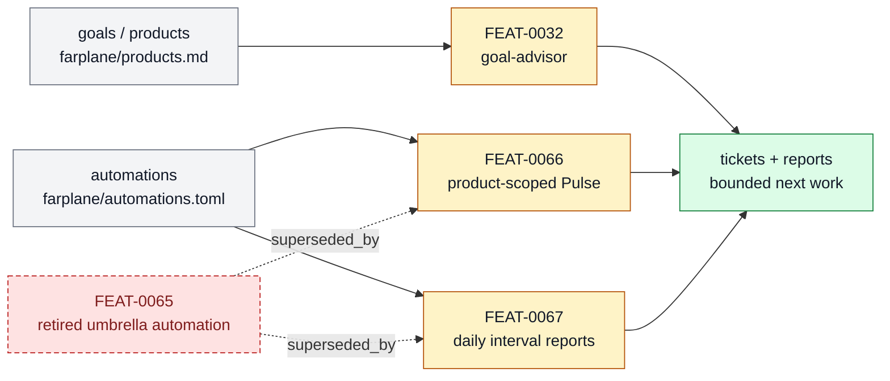

# Horizon Loop

The longer-running project loop that coordinates goals, Goal Packets, Pulse, Interval,
backoff, PR watching, feedback, and horizon-level ticket supply. This page is the
product-layer owner for that subsystem: it explains what belongs here, which feature
specs make up the stack, and where adjacent responsibilities should move.

```text
horizon_loop(change, repo_state?) -> owned_feature_set + boundary_decision + maintenance_signal
```

## At A Glance

- System ID: `SYS-0003`
- Status: `implemented`
- Primary feature: `FEAT-0032`
- Owner spec: `docs/systems/horizon-loop.md`
- Feature count: `5`

## Role

Horizon Loop owns recurring and longer-running autonomy: Goal Packets, Pulse, Interval,
Rhythm, Horizon, backoff, PR watching, and ticket-supply learning. It decides the next
bounded move without turning Farplane into a hidden daemon.

## Feature Docs

- [FEAT-0029 Retired Goal Packet architecture](../features/FEAT-0029-goal-packet-architecture-for-native-codex-goals.md)
- [FEAT-0032 Goal Advisor execution loop](../features/FEAT-0032-goal-advisor-execution-compilation.md)
- [FEAT-0065 Pulse and interval automation](../features/FEAT-0065-pulse-and-interval-automation.md)
- [FEAT-0066 Product-scoped Pulse loops](../features/FEAT-0066-product-scoped-pulse-loops.md)
- [FEAT-0067 Daily interval review reports](../features/FEAT-0067-daily-interval-review-reports.md)

## What Belongs Here

Goal-backed continuation, pulse actions, interval reports, horizon recalibration,
adaptive waits, reward closure, and learning signals that create or reshape ticket
supply.

## What Belongs Elsewhere

Single-ticket execution belongs in Work Loop; external invocation boundaries belong in
Invocation Runtime; proof standards belong in Proof And Review.

## Operating Contract

- Recurring loops must have visible prompts, reports, tickets, or automations as state owners.
- Automations may no-op when no safe valuable action exists.
- Backoff and polling stay tracked and bounded.
- Human authority remains required for ambiguous or high-risk direction.
- Feature-level behavior belongs in `docs/features/FEAT-*.md`; this page owns the system boundary and feature grouping.
- Registry data is generated from system and feature docs, not edited by hand.
- When a capability no longer deserves a feature page, fold its current truth into the best owner and remove active refs.

## System Flow



The Horizon Loop coordinates longer-running goals, Pulse, Interval, and report-backed ticket supply without becoming a hidden daemon.

## Surfaces

- `docs/features/FEAT-0029-goal-packet-architecture-for-native-codex-goals.md`
- `docs/features/FEAT-0065-pulse-and-interval-automation.md`
- `docs/features/FEAT-0066-product-scoped-pulse-loops.md`
- `docs/features/FEAT-0067-daily-interval-review-reports.md`

## Proof And Maintenance

- Registry proof: `python3 docs/features/validate_features.py`.
- Link proof: `python3 bin/validators/check_doc_refs.py`.
- Update this system page when product-layer boundaries or feature membership changes.
- Update feature pages when capability behavior changes.
- Regenerate registries and commit generated outputs with the source docs.

## Change History

- 2026-06-27: Migrated into the reader-first system-spec shape.
- 2026-07-07: Made Goal Advisor the primary Horizon feature and added
  experimental product-scoped Pulse plus daily interval report handles.
