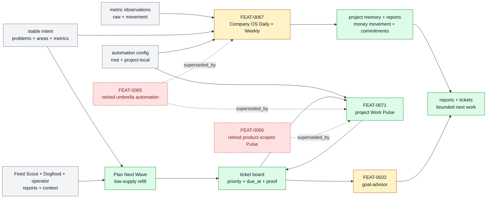

# Horizon Loop

The project control loop where Company OS Daily and Weekly maintain
source-grounded project memory around money movement, constraints, decisions,
and next commitments. Work Pulse dispatches or checks in accepted work, and
Plan Next Wave remains the side-effect-free low-supply refill path. The former
Interval weekly-draft and broad promotion route is legacy reference only.

```text
horizon_loop(change, repo_state?) -> owned_feature_set + boundary_decision + maintenance_signal
```

## At A Glance

- System ID: `SYS-0003`
- Status: `implemented`
- Primary feature: `FEAT-0032`
- Owner spec: `docs/systems/horizon-loop.md`
- Feature count: `6`

## Role

Horizon Loop owns recurring and longer-running autonomy: Goal Packets, one Work
Pulse, Company OS Daily/Weekly project memory and reports, low-supply refill,
backoff, PR watching, and bounded handoffs from Feed Scout, Dogfood, and the
operator.

## Feature Docs

- [FEAT-0029 Retired Goal Packet architecture](../features/FEAT-0029-goal-packet-architecture-for-native-codex-goals.md)
- [FEAT-0032 Goal Advisor execution loop](../features/FEAT-0032-goal-advisor-execution-compilation.md)
- [FEAT-0065 Pulse and interval automation](../features/FEAT-0065-pulse-and-interval-automation.md)
- [FEAT-0066 Product-scoped Pulse loops](../features/FEAT-0066-product-scoped-pulse-loops.md)
- [FEAT-0067 Daily interval review reports](../features/FEAT-0067-daily-interval-review-reports.md)
- [FEAT-0071 Project Work Pulse](../features/FEAT-0071-project-work-pulse.md)

## What Belongs Here

Goal-backed continuation, Pulse dispatch/check-ins, Company OS review and
project memory, low-supply refill, adaptive waits, and visible automation
cadence.

## What Belongs Elsewhere

Single-ticket execution belongs in Work Loop; external source discovery belongs
in Source And Sidecar Systems; experiment selection belongs in Self-Improvement
And Learning; proof standards belong in Proof And Review.

## Operating Contract

- Recurring loops must have visible prompts, reports, tickets, or automations as state owners.
- Automations may no-op when no safe valuable action exists.
- Exactly one base project automation is a heartbeat: Work Pulse. Other
  recurring jobs are bounded cron/manual automations.
- Daily maintains one source-grounded memory result per eligible Project.
  Weekly reviews the complete frozen Project set and carries forward supported
  commitments. Both may update only authorized existing issues and neither
  admits work, invents strategy, promotes broad knowledge, or executes work.
- Work Pulse dispatches executable tickets and calls Plan Next Wave only when
  ready supply is low. Plan Next Wave ranks configured skill calls from stable
  problems, areas, metric movement, source-backed context, and ticket history.
- Backoff and polling stay tracked and bounded.
- Human authority remains required for ambiguous or high-risk direction.
- Feature-level behavior belongs in `docs/features/FEAT-*.md`; this page owns the system boundary and feature grouping.
- Registry data is generated from system and feature docs, not edited by hand.
- When a capability no longer deserves a feature page, fold its current truth into the best owner and remove active refs.

## System Flow



The Horizon Loop coordinates one execution heartbeat, one Company OS memory
and review path, and one low-supply refill planner without giving every source
its own strategy ledger or executor.

## Surfaces

- `docs/features/FEAT-0029-goal-packet-architecture-for-native-codex-goals.md`
- `docs/features/FEAT-0065-pulse-and-interval-automation.md`
- `docs/features/FEAT-0066-product-scoped-pulse-loops.md`
- `docs/features/FEAT-0067-daily-interval-review-reports.md`
- `docs/features/FEAT-0071-project-work-pulse.md`

## Proof And Maintenance

- Registry proof: `python3 docs/features/validate_features.py`.
- Link proof: `python3 bin/validators/check_doc_refs.py`.
- Update this system page when product-layer boundaries or feature membership changes.
- Update feature pages when capability behavior changes.
- Regenerate registries and commit generated outputs with the source docs.

## Change History

- 2026-06-27: Migrated into the reader-first system-spec shape.
- 2026-07-07: Made Goal Advisor the primary Horizon feature and added
  experimental product-scoped Pulse plus daily interval report handles.
- 2026-07-10: Retired product-scoped Pulse and added one project Work Pulse.
- 2026-07-11: Limited heartbeat ownership to Work Pulse and added bounded
  scheduled BAU/source/experiment ticket sources.
- 2026-07-12: Centralized exploratory ticket admission in the adaptive Work
  Pulse planner while preserving bounded evidence-backed recovery admission in
  scheduled jobs.
- 2026-07-25: Consolidated the metric-to-ticket loop: Interval owns
  report-first evidence admission, Work Pulse owns dispatch and due_at
  ordering, and Plan Next Wave owns only low-supply refill.
- 2026-08-20: Made Interval the parent reporting-and-knowledge workflow with
  Daily incremental owner updates and Weekly receipt consolidation/showcase.
- 2026-08-20: Replaced eager Daily owner updates with a weekly working draft
  and Weekly selective promotion.
