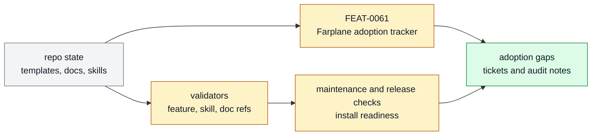

# Maintenance And Release OS

The release hygiene, adoption scans, manifests, rollout checks, and maintenance
validators that keep Farplane coherent as it evolves. This page is the product-layer
owner for that subsystem: it explains what belongs here, which feature specs make up the
stack, and where adjacent responsibilities should move.

```text
maintenance_and_release_os(change, repo_state?) -> owned_feature_set + boundary_decision + maintenance_signal
```

## At A Glance

- System ID: `SYS-0009`
- Status: `implemented`
- Primary feature: `FEAT-0061`
- Owner spec: `docs/systems/maintenance-release-os.md`
- Feature count: `1`

## Role

Maintenance And Release OS owns release and adoption coherence: manifest checks,
template rollout evidence, adoption scans, and release hygiene.

## Feature Docs

- [FEAT-0061 Farplane adoption tracker CLI](../features/FEAT-0061-farplane-adoption-tracker-cli.md)

## What Belongs Here

Template refs, filesystem lifecycle checks, adoption tracking, release evidence, and
revamp/release consolidation workflows.

## What Belongs Elsewhere

Documentation architecture belongs in Documentation OS. Feature-level behavior belongs
in feature specs; system narrative belongs in system docs; one-off proof stays with
tickets and experiments.

## Operating Contract

- Release claims require validators and adoption evidence.
- Maintenance workflows should reduce artifact count while increasing clarity.
- Feature-level behavior belongs in `docs/features/FEAT-*.md`; this page owns the system boundary and feature grouping.
- Registry data is generated from system and feature docs, not edited by hand.
- When a capability no longer deserves a feature page, fold its current truth into the best owner and remove active refs.

## System Flow



Maintenance And Release OS checks whether Farplane's shipped surfaces remain coherent, adopted, and release-ready.

## Surfaces

- `docs/features/FEAT-0061-farplane-adoption-tracker-cli.md`
- `docs/farplane-framework/harness-maintenance.md`
- `docs/templates/registry.jsonl`

## Proof And Maintenance

- Registry proof: `python3 docs/features/validate_features.py`.
- Link proof: `python3 bin/validators/check_doc_refs.py`.
- Update this system page when product-layer boundaries or feature membership changes.
- Update feature pages when capability behavior changes.
- Regenerate registries and commit generated outputs with the source docs.

## Change History

- 2026-06-27: Migrated into the reader-first system-spec shape.
