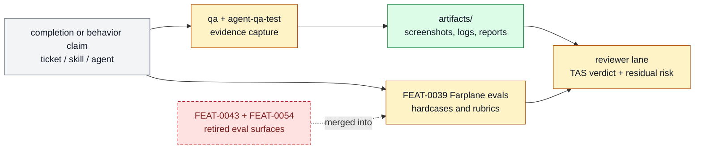

# Proof And Review

The QA, review, completion, and adversarial testing surfaces that keep Farplane work
evidence-backed instead of self-certified. This page is the product-layer owner for that
subsystem: it explains what belongs here, which feature specs make up the stack, and
where adjacent responsibilities should move.

```text
proof_and_review(change, repo_state?) -> owned_feature_set + boundary_decision + maintenance_signal
```

## At A Glance

- System ID: `SYS-0005`
- Status: `implemented`
- Primary feature: `FEAT-0008`
- Owner spec: `docs/systems/proof-review.md`
- Feature count: `6`

## Role

Proof And Review owns how Farplane decides that work is done: QA evidence, review
rubrics, adversarial testing, prompt behavior checks, and completion proof. It protects
the system from self-certification.

## Feature Docs

- [FEAT-0008 Artifact-first QA and completion proof](../features/FEAT-0008-artifact-first-qa-and-completion-proof.md)
- [FEAT-0031 Retired agent behavior test workflow](../features/FEAT-0031-agent-behavior-test-workflow.md)
- [FEAT-0034 Adversarial agent QA test skill](../features/FEAT-0034-adversarial-agent-qa-test-skill.md)
- [FEAT-0039 Farplane evals](../features/FEAT-0039-behavior-correction-hardcase-metadata-and-narrow-eval-capture.md)
- [FEAT-0043 Retired project-level system prompt eval suite](../features/FEAT-0043-project-level-system-prompt-eval-suite.md)
- [FEAT-0054 Retired modular skill-local eval tasks](../features/FEAT-0054-modular-skill-local-eval-tasks.md)

## What Belongs Here

Artifact-first QA, reviewer lanes, evidence bundles, adversarial agent QA,
Eval behavior-trace capture, Farplane evals, prompt eval cases, skill-local eval
cases, first-principles experiment diagnosis, scientific-inference review, and
completion verdicts.

## What Belongs Elsewhere

Task scope belongs in tickets; feature behavior belongs in feature specs; metric choice
belongs in Self-Improvement And Learning.

## Operating Contract

- Completion claims cite evidence and checks.
- Material work uses independent QA or review when available.
- Review outputs name blockers, verdict, evidence checked, and residual risk.
- QA checklists inspect artifacts, metrics describe optional measured signals,
  review rubrics classify readiness, and reward events preserve reasons and
  repair hints for later learning.
- Proof scales with risk rather than becoming ceremony for every tiny edit.
- Experimental work preregisters its expected observation through the metric or
  experiment owner. Material negative surprise or implausibly positive results
  route to `agent-qa-test:experiment`; final causal inference routes through
  `scientific-evidence`. Domain skills remain experiment executors.
- Feature-level behavior belongs in `docs/features/FEAT-*.md`; this page owns the system boundary and feature grouping.
- Registry data is generated from system and feature docs, not edited by hand.
- When a capability no longer deserves a feature page, fold its current truth into the best owner and remove active refs.

## System Flow



Proof And Review turns claims into evidence, evals, independent judgment, and durable proof references.

## Surfaces

- `docs/features/FEAT-0008-artifact-first-qa-and-completion-proof.md`
- `docs/features/FEAT-0039-behavior-correction-hardcase-metadata-and-narrow-eval-capture.md`
- `skills/qa/SKILL.md`
- `skills/review/SKILL.md`
- `docs/review/rubrics`
- `docs/review/rubrics/scientific-evidence.md`

## Proof And Maintenance

- Registry proof: `python3 docs/features/validate_features.py`.
- Link proof: `python3 bin/validators/check_doc_refs.py`.
- Update this system page when product-layer boundaries or feature membership changes.
- Update feature pages when capability behavior changes.
- Regenerate registries and commit generated outputs with the source docs.

## Change History

- 2026-06-27: Migrated into the reader-first system-spec shape.
- 2026-07-07: Consolidated eval feature ownership under `FEAT-0039`.
- 2026-07-25: Added expectation-triggered scientific diagnosis and independent
  inference-readiness review to the existing Agent QA capability.
