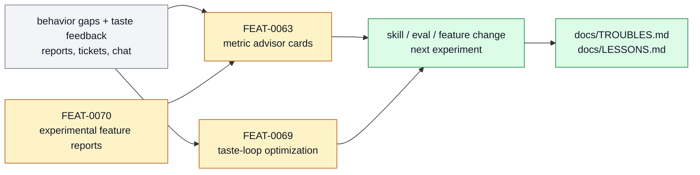

# Self-Improvement And Learning

The learning loop that observes behavior gaps, captures hardcases, chooses metrics,
routes correction, and turns repeated failures into skills, evals, or docs. This page is
the product-layer owner for that subsystem: it explains what belongs here, which feature
specs make up the stack, and where adjacent responsibilities should move.

```text
self_improvement_and_learning(change, repo_state?) -> owned_feature_set + boundary_decision + maintenance_signal
```

## At A Glance

- System ID: `SYS-0007`
- Status: `implemented`
- Primary feature: `FEAT-0063`
- Owner spec: `docs/systems/self-improvement-learning.md`
- Feature count: `3`

## Role

Self-Improvement And Learning owns correction loops: observe behavior gaps, choose
metrics, capture hardcases, route repairs, and turn repeated failures into skills,
evals, docs, tickets, or lessons.

## Feature Docs

- [FEAT-0063 Metric advisor cards](../features/FEAT-0063-metric-advisor-cards.md)
- [FEAT-0069 Taste Loop human-feedback optimization](../features/FEAT-0069-taste-loop-human-feedback-optimization.md)
- [FEAT-0070 Experimental feature evaluation reports](../features/FEAT-0070-experimental-feature-evaluation-reports.md)

## What Belongs Here

Gap analysis, metric cards, hardcase capture, lesson promotion, experimental feature
evaluation, human-feedback optimization, and correction-route decisions.

## What Belongs Elsewhere

Execution of a selected build remains in Work Loop; reusable skill packaging remains in
Skill System; source discovery remains in Source And Sidecar Systems.

## Operating Contract

- Corrections name the gap, evidence, owner, and proof path.
- Metric cards choose honest primary and guard metrics before optimization.
- Repeated misses promote into durable prevention surfaces.
- Broad self-improvement migrations require representative proof.
- Feature-level behavior belongs in `docs/features/FEAT-*.md`; this page owns the system boundary and feature grouping.
- Registry data is generated from system and feature docs, not edited by hand.
- When a capability no longer deserves a feature page, fold its current truth into the best owner and remove active refs.

## System Flow



Self-Improvement And Learning converts failures, feedback, and dogfood reports into metrics, lessons, evals, and next feature experiments.

## Surfaces

- `docs/features/FEAT-0069-taste-loop-human-feedback-optimization.md`
- `docs/features/FEAT-0070-experimental-feature-evaluation-reports.md`
- `docs/LESSONS.md`
- `docs/TROUBLES.md`
- `skills/metric-advisor/SKILL.md`

## Proof And Maintenance

- Registry proof: `python3 docs/features/validate_features.py`.
- Link proof: `python3 bin/validators/check_doc_refs.py`.
- Update this system page when product-layer boundaries or feature membership changes.
- Update feature pages when capability behavior changes.
- Regenerate registries and commit generated outputs with the source docs.

## Change History

- 2026-06-27: Migrated into the reader-first system-spec shape.
- 2026-07-07: Added experimental Taste Loop human-feedback optimization as a
  self-improvement feature.
- 2026-07-07: Moved consolidated eval feature ownership to Proof And Review.
- 2026-07-07: Added experimental feature evaluation reports as a
  self-improvement feature.
