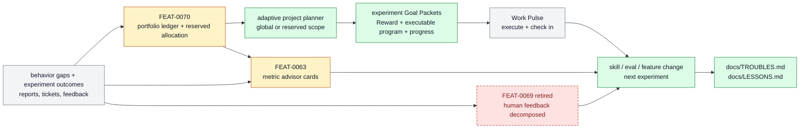

# Self-Improvement And Learning

The learning loop that observes behavior gaps from completed-ticket learning
reports, reviews experiment Goal Packets, supplies bounded experiment
candidates, and turns proven outcomes into skills, evals, docs, features, or
policy. This page owns self-improvement selection and learning; Work Pulse still
owns experiment execution and check-ins.

```text
self_improvement_and_learning(change, repo_state?) -> owned_feature_set + boundary_decision + maintenance_signal
```

## At A Glance

- System ID: `SYS-0007`
- Status: `implemented`
- Primary feature: `FEAT-0063`
- Owner spec: `docs/systems/self-improvement-learning.md`
- Feature count: `3`

## Role

Self-Improvement And Learning owns correction loops: observe behavior gaps,
review existing experiments, choose metrics and proof routes, supply bounded
experiment candidates, and promote repeated evidence into durable owners.

## Feature Docs

- [FEAT-0063 Metric advisor cards](../features/FEAT-0063-metric-advisor-cards.md)
- [FEAT-0069 Retired Taste Loop human-feedback optimization](../features/FEAT-0069-taste-loop-human-feedback-optimization.md)
- [FEAT-0070 Experimental feature evaluation reports](../features/FEAT-0070-experimental-feature-evaluation-reports.md)

## What Belongs Here

Gap analysis, metric cards, hardcase capture, lesson promotion, Dogfood
experiment review/candidate supply, human-feedback optimization, and
correction-route decisions.

## What Belongs Elsewhere

Execution of a selected build remains in Work Loop; reusable skill packaging remains in
Skill System; source discovery remains in Source And Sidecar Systems; BAU
problem reports remain in Horizon Loop.

## Operating Contract

- Corrections name the gap, evidence, owner, and proof path.
- Metric cards choose honest primary and guard metrics before optimization.
- Repeated misses promote into durable prevention surfaces.
- Broad self-improvement migrations require representative proof.
- Completed-ticket learning writes a compact report and Core projects at most
  one deduped actionable ticket from its strongest grounded finding. Direct
  corrections use a fix program; uncertain improvements use a prove-or-reject
  program before durable adoption. Stable semantic keys dedupe paraphrases,
  and generated learning tickets cannot project another learning ticket.
- Dogfood Review runs as the weekly portfolio learner and reserved allocator: it reads active
  and recent archived experiment packets plus its prior report, carries a
  derived outcome ledger, consumes Core Reward history and harness-health
  evidence, applies
  `harness.areas.self_improvement.planner_instruction`, then asks the adaptive planner for a target-five
  `reserved_area:self_improvement` wave. It counts completion-projected tickets
  once and does not recreate them. Pulse alone materializes admitted specs.
- Every experiment carries Reward rows and Goal Packet state; Work Pulse alone
  executes the experiment and resumes matured check-ins. Delayed packets put
  the executable check-in instructions in `program.md`; the resumed worker
  reads and runs that program directly.
- Feature-level behavior belongs in `docs/features/FEAT-*.md`; this page owns the system boundary and feature grouping.
- Registry data is generated from system and feature docs, not edited by hand.
- When a capability no longer deserves a feature page, fold its current truth into the best owner and remove active refs.

### Doctrine Promotion

One successful bounded experiment changes its tested surface; it does not
automatically become general policy.

```text
accepted experiment
-> pattern candidate
-> transfer test on a similar problem
-> scoped doctrine
-> bounded rollout tickets
```

The promotion record names scope, preconditions, evidence, known
counterexamples, transfer tests, rollback, and the next review point. A failed
transfer is counterevidence: narrow or reject the doctrine instead of hiding
the result. Dogfood may propose promotion and rollout work, but ticket-local
evidence and review justify the durable change.

## System Flow



Self-Improvement And Learning converts failures, feedback, and experiment
results into metrics, lessons, evals, transfer candidates, and a target-five
weekly reserved experiment wave.

## Surfaces

- `docs/features/FEAT-0069-taste-loop-human-feedback-optimization.md`
- `docs/features/FEAT-0070-experimental-feature-evaluation-reports.md`
- `docs/LESSONS.md`
- `docs/TROUBLES.md`
- `skills/metric-advisor/SKILL.md`
- `skills/dogfood-review/SKILL.md`
- `skills/self-improve/SKILL.md`
- `farplane/automations.toml`

## Proof And Maintenance

- Registry proof: `python3 docs/features/validate_features.py`.
- Link proof: `python3 bin/validators/check_doc_refs.py`.
- Update this system page when product-layer boundaries or feature membership changes.
- Update feature pages when capability behavior changes.
- Regenerate registries and commit generated outputs with the source docs.

## Change History

- 2026-06-27: Migrated into the reader-first system-spec shape.
- 2026-07-07: Added experimental Taste Loop human-feedback optimization as a
  self-improvement feature.
- 2026-07-11: Retired Taste Loop as a controller; Dogfood creates ordinary
  feedback experiment packets and Work Pulse owns execution/check-ins/review waits.
- 2026-07-07: Moved consolidated eval feature ownership to Proof And Review.
- 2026-07-07: Added experimental feature evaluation reports as a
  self-improvement feature.
- 2026-07-11: Made Dogfood Review the weekly experiment-review and Goal Packet
  ticket-supply owner while keeping execution/check-ins in Work Pulse.
- 2026-07-11: Made Dogfood a history-aware portfolio learner/planner and moved
  delayed check-in execution instructions into each experiment `program.md`.
- 2026-07-12: Centralized experiment admission in Work Pulse while allowing
  Dogfood to create bounded direct recovery from settled attributable failures.
- 2026-07-13: Made Dogfood the target-five weekly reserved self-improvement
  allocator while keeping planner logic shared and Pulse ownership of ticket
  materialization, workers, and check-ins.
