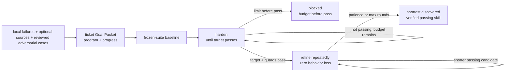

# Self-Improvement And Learning

Self-improvement optimizes one existing skill against a frozen canonical eval
suite. Native Goal owns continuation through the ordinary ticket Goal Packet.

```text
self_improve(target_skill, owning_ticket, performance_target, phase_budgets)
  -> shortest_verified_passing_candidate + eval_evidence
```

## Ownership Contract

```text
target skill:
  SKILL.md                   editable behavior
  evals/evals.json           canonical cases

owning ticket Goal Packet:
  ticket.md                  objective, scope, Done, proof
  program.md                 harden/refine policy, metrics, budgets, stops
  progress.md                append-only observations and evidence
  artifacts/native-goal-prompt.md

generated:
  .farplane/evals/runs/      Eval evidence only
```

`skills/self-improve/references/goal-program-template.md` is the reusable
policy source instantiated into each ticket. It is not runtime state. Existing
target-local `self-improve/*` folders are legacy experiment material; the
active workflow does not read, write, generate, parse, or migrate them.

## Optimization Contract

The objective is lexicographic:

1. **Harden behavior.** Freeze the suite, record the baseline, then make one
   bounded instruction change and run the complete suite per Goal turn. Enter
   refinement only after the performance target and every guard pass.
2. **Refine length.** Repeatedly remove, merge, or condense instructions. Keep
   only candidates that preserve the hardened floor and every guard while
   reducing length.

Each phase declares `max_rounds` and patience. Hardening exhaustion blocks
without refinement. Refinement stops on patience or its maximum rounds and
returns the shortest verified passing candidate discovered within the budget.

No deterministic decision helper, structured event schema, stored counter,
campaign, target-local loop state, daemon, or second continuation engine
participates. Ticket `progress.md` records ordinary observations; Eval supplies
measurements; native Goal applies the program.

## Coverage And Idea Generation

Start with local failures and scored history. External method discovery is
optional, not automatic:

- when local evidence cannot resolve the method, route bounded practitioner,
  paper, or book work through
  `skill-maintenance:upgrade_skill_from_sources`;
- keep source packets outside Goal state and record `adopt | adapt | reject |
  defer` decisions before testing a method;
- route adversarial break cases through `agent-qa-test`, then require a
  distinct evidence reviewer and Eval owner to accept them.

The suite remains frozen for the full Goal. A newly accepted source or
adversarial case stops the current comparison, regenerates the Goal Packet, and
requires a fresh baseline.

## System Flow



## Boundaries

- `goal-advisor` compiles and freshness-binds the packet and native launcher.
- `eval` owns clean execution, grading, comparison, and run artifacts.
- `metric-advisor` helps when the honest performance target or guard is unclear.
- `agent-qa-test` proposes adversarial evidence but cannot approve its own case.
- `skill-maintenance` owns accepted skill writeback and bounded source upgrades.
- Delayed real-world outcomes belong to the product experiment able to observe
  them, not to this prompt-optimization loop.

## Feature Docs

- [FEAT-0063 Metric advisor cards](../features/FEAT-0063-metric-advisor-cards.md)
- [FEAT-0069 Retired Taste Loop human-feedback optimization](../features/FEAT-0069-taste-loop-human-feedback-optimization.md)
- [FEAT-0070 Experimental feature evaluation reports](../features/FEAT-0070-experimental-feature-evaluation-reports.md)

## Proof And Maintenance

- Skill validation: `python3 skills/skill-creator/scripts/quick_validate.py skills/self-improve`.
- Eval JSON and query-spoiler validation through the existing Eval tooling.
- Skill-system validation: `python3 skills/skill-maintenance/scripts/check_skills.py --write`.
- Behavior proof: harden transition, harden exhaustion, regression rejection,
  and refinement convergence through Agent QA plus separate evidence review.

## Change History

- 2026-06-27: Migrated into the reader-first system-spec shape.
- 2026-07-07 through 2026-07-16: Experimented with broader feedback and
  portfolio orchestration.
- 2026-07-19: Reduced optimization state to target-local files.
- 2026-07-20: Added a deterministic helper and one-shot distillation experiment.
- 2026-07-21: Replaced that rejected design with one ordinary Goal Packet and a
  two-phase harden-then-refine program template.
