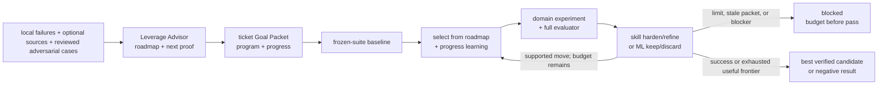

# Self-Improvement And Learning

Self-Improvement and Learning runs bounded, measurable improvement campaigns
over skills or ML systems. Leverage Advisor chooses every next experiment from
the campaign roadmap plus `progress.md` learnings; the domain skill executes;
native Goal owns continuation through the ordinary ticket Goal Packet.

```text
self_improve(target_skill, owning_ticket, performance_target, phase_budgets)
  -> shortest_verified_passing_candidate + eval_evidence

ml_autoresearch(target_system, owning_ticket, mutable_surface,
                frozen_evaluator, primary_metric, budgets)
  -> best_verified_candidate + experiment_evidence
```

## Ownership Contract

```text
target skill:
  SKILL.md                   editable behavior
  evals/evals.json           canonical cases

owning ticket Goal Packet:
  ticket.md                  objective, scope, Done, proof
  program.md                 initial roadmap, selection policy, metrics, budgets, stops
  progress.md                append-only selections, observations, learning, evidence
  artifacts/native-goal-prompt.md
  artifacts/experiments/     optional bulky trial receipts

generated:
  .farplane/evals/runs/      Eval evidence only
```

The Self Improve and ML Autoresearch Goal program templates are reusable policy
sources instantiated into each ticket. They are not runtime state. Existing
target-local `self-improve/*` folders are legacy experiment material; the
active workflow does not read, write, generate, parse, or migrate them.

## Shared Selection Contract

```text
advise_leverage(subject, objective, evidence, constraints, catalog?,
                progress?, remaining_budget?)
  -> ranked_frontier + next_wave + first_proof + replan_conditions + source_gap?
```

Leverage Advisor owns candidate generation, compounding ranking, and the next
proof. Before every experiment it reads the `program.md` roadmap,
`progress.md` learnings, current evidence receipts, and remaining budget. It
does not execute the experiment, compile the Goal, create experiment tickets,
or own campaign state.

When the candidate frontier is missing, stale, or evidence-thin, Leverage
Advisor conditionally routes bounded parity/source research or Best Of Worlds.
Start from campaign-local catalog content; do not require a global registry.

## Optimization Contract

The objective is lexicographic:

1. **Harden behavior.** Freeze the suite, record the baseline, then make one
   bounded instruction change and run the complete suite per Goal turn. Enter
   refinement only after the performance target and every guard pass.
2. **Refine length.** Repeatedly remove, merge, or condense instructions. Keep
   only candidates that preserve the hardened floor and every guard while
   reducing length.

Each phase declares `max_rounds` and patience. Hardening exhaustion blocks
without refinement. Refinement stops on patience or its maximum rounds and
returns the shortest verified passing candidate discovered within the budget.

Before every harden or refine round, Leverage Advisor selects one experiment
from the current frontier. No deterministic decision helper, structured event
schema, stored counter, target-local loop state, daemon, or second continuation
engine participates. Ticket `progress.md` records ordinary observations; Eval
supplies measurements; native Goal applies the program.

## ML Autoresearch Contract

ML Autoresearch freezes the evaluator, data/split boundary, metric, guards,
mutable surface, baseline, and compute/spend budget before the first change.
Each Goal turn selects one attributable technique experiment through Leverage
Advisor, preregisters its hypothesis and falsifier, runs correctness smokes and
the full evaluator, appends an immutable receipt, and replans. The campaign
keeps the best verified candidate or returns an evidence-backed negative result.

## Coverage And Idea Generation

Start with local failures and scored history. External method discovery is
optional, not automatic:

- when local evidence cannot resolve the method, route bounded practitioner,
  paper, or book work through
  `skill-maintenance:upgrade_skill_from_sources`;
- keep source packets outside Goal state and record `adopt | adapt | reject |
  defer` decisions before testing a method;
- route adversarial break cases through `agent-qa-test`, then require a
  distinct evidence reviewer and Eval owner to accept them.

The suite remains frozen for the full Goal. A newly accepted source or
adversarial case stops the current comparison, regenerates the Goal Packet, and
requires a fresh baseline.

## System Flow



## Boundaries

- `goal-advisor` compiles and freshness-binds the packet and native launcher.
- `leverage-advisor` generates and ranks the frontier and chooses each next
  experiment from roadmap plus progress evidence.
- `eval` owns clean execution, grading, comparison, and run artifacts.
- `metric-advisor` helps when the honest performance target or guard is unclear.
- `agent-qa-test` proposes adversarial evidence but cannot approve its own case.
- `skill-maintenance` owns accepted skill writeback and bounded source upgrades.
- `ml-autoresearch` owns ML mutable-surface execution, receipts, and final
  candidate verification under a frozen evaluator.
- Delayed real-world outcomes belong to the product experiment able to observe
  them, not to this prompt-optimization loop.

## Feature Docs

- [FEAT-0063 Metric advisor cards](../features/FEAT-0063-metric-advisor-cards.md)
- [FEAT-0069 Retired Taste Loop human-feedback optimization](../features/FEAT-0069-taste-loop-human-feedback-optimization.md)
- [FEAT-0070 Experimental feature evaluation reports](../features/FEAT-0070-experimental-feature-evaluation-reports.md)

## Proof And Maintenance

- Skill validation: `python3 skills/skill-creator/scripts/quick_validate.py skills/self-improve skills/ml-autoresearch`.
- Eval JSON and query-spoiler validation through the existing Eval tooling.
- Skill-system validation: `python3 skills/skill-maintenance/scripts/check_skills.py --write`.
- Behavior proof: harden transition, harden exhaustion, regression rejection,
  and refinement convergence through Agent QA plus separate evidence review.

## Change History

- 2026-06-27: Migrated into the reader-first system-spec shape.
- 2026-07-07 through 2026-07-16: Experimented with broader feedback and
  portfolio orchestration.
- 2026-07-19: Reduced optimization state to target-local files.
- 2026-07-20: Added a deterministic helper and one-shot distillation experiment.
- 2026-07-21: Replaced that rejected design with one ordinary Goal Packet and a
  two-phase harden-then-refine program template.
- 2026-07-22: Made Leverage Advisor the shared evidence-updated experiment
  selector and added the ML Autoresearch domain entrypoint.
