# Self-Improvement And Learning

Self-Improvement and Learning runs bounded, measurable improvement campaigns
over skills, ML systems, or human-evaluated artifacts. Each campaign first
grounds a source stage, then stores its live hypothesis search state in one
ticket-local JSON tree. The active Goal owns `choose_next` from that tree plus
current evidence; Leverage Advisor is conditional on a real multi-option
judgment; the domain skill executes; native Goal owns continuation.

```text
self_improve(target_skill, owning_ticket, performance_target, phase_budgets)
  -> shortest_verified_passing_candidate + eval_evidence

ml_autoresearch(target_system, owning_ticket, mutable_surface,
                frozen_evaluator, primary_metric, budgets)
  -> best_verified_candidate + experiment_evidence
```

## Ownership Contract

```text
target skill:
  SKILL.md                   editable behavior
  evals/evals.json           canonical cases

owning ticket Goal Packet:
  ticket.md                  objective, scope, Done, proof
  program.md                 source/search policy, metrics, budgets, stops
  hypothesis-tree.json       current source synthesis, hypotheses, results, insights
  progress.md                append-only selection and mutation receipts
  artifacts/native-goal-prompt.md
  artifacts/experiments/     optional bulky trial receipts

generated:
  .farplane/evals/runs/      Eval evidence only
```

The Self Improve and ML Autoresearch Goal program templates are reusable policy
sources instantiated into each ticket. They are not runtime state. Existing
target-local `self-improve/*` folders are legacy experiment material; the
active workflow does not read, write, generate, parse, or migrate them.

## Shared Decision Backbone

```text
choose_next(objective, evidence, eligible_moves, remaining_budget)
  -> execute | diagnose | report_now | request_feedback | stop
```

The active Goal owns this five-step loop:

```text
observe -> choose_next -> act -> verify -> write_back
```

The domain skill derives eligible moves from the tree and evidence. When one
move is mechanically implied, it executes directly. When several credible
moves require judgment, it invokes Leverage Advisor for one evidence-backed
ordinal comparison that includes `report_now`, `request_feedback`, and `stop`.
Leverage Advisor does not execute, compile the Goal, or own campaign state.

Metric Advisor is used at setup or when the measurement contract becomes
invalid. Goal Advisor compiles or regenerates the packet. Plan Next Wave only
refills the project board and never enters an active campaign. These boundaries
make the Goal—not a chain of advisors—the sole next-decision owner.

When the candidate frontier is missing, stale, or evidence-thin, Leverage
Advisor conditionally routes bounded parity/source research or Best Of Worlds.
Start from campaign-local catalog content; do not require a global registry.

## Optimization Contract

The objective is lexicographic:

1. **Harden behavior.** Freeze the suite, record the baseline, then make one
   bounded instruction change and run the complete suite per Goal turn. Enter
   refinement only after the performance target and every guard pass.
2. **Refine length.** Repeatedly remove, merge, or condense instructions. Keep
   only candidates that preserve the hardened floor and every guard while
   reducing length.

Each phase declares `max_rounds` and patience. Hardening exhaustion blocks
without refinement. Refinement stops on patience or its maximum rounds and
returns the shortest verified passing candidate discovered within the budget.

Before every harden or refine round, the Goal applies `choose_next`; Leverage
Advisor is conditional on a real ranking decision. No tournament, stored
counter, daemon, or second continuation engine participates. The JSON tree
stores current branch state, ticket `progress.md` records chronological
receipts, Eval supplies measurements, and native Goal applies the program.

## ML Autoresearch Contract

ML Autoresearch freezes the evaluator, data/split boundary, metric, guards,
mutable surface, baseline, and compute/spend budget before the first change.
Each Goal turn selects one attributable intervention or diagnostic hypothesis
through `choose_next`, conditionally using Leverage Advisor, preregisters its expectation and falsifier, runs
correctness smokes and the full evaluator, updates the tree, appends an
immutable receipt, and replans. The campaign keeps the best verified candidate
or returns an evidence-backed negative result.

## Source Stage And Hypothesis Generation

Every experiment-backed campaign runs a source stage before the first
mutation. The stage can finish from local failures and scored history alone, or
add supplied material, configured Feed Scout signals, linked papers/repos, and
bounded direct research when the frontier is weak. It extracts only applicable
techniques, mechanisms, variables, failure conditions, and source references;
raw source prose stays outside Goal state.

Generate intervention hypotheses from that synthesis through combination,
permutation, transfer, ablation, or new direction. Record their mechanism,
expected observation, falsifier, expected compounding reward, and short reward
basis. Use diagnostic hypotheses only after surprising, invalid, prerequisite-
uncertain, or causally ambiguous evidence. A diagnostic branch should learn
enough to repair, reject, defer, or backtrack; it is not an obligation to rescue
every failed technique.

- preserve `adopt | adapt | reject | defer` source dispositions;
- follow linked primary evidence when it materially changes mechanism or
  confidence, without requiring direct-paper subscriptions;
- route adversarial break cases through `agent-qa-test`, then require a
  distinct evidence reviewer and Eval owner to accept them;
- guard against seed anchoring by preserving credible sibling branches and
  expanding sources only for a named coverage gap.

The suite remains frozen for the full Goal. A newly accepted source or
adversarial case stops the current comparison, regenerates the Goal Packet, and
requires a fresh baseline.

## Research Grounding

- `SRC-0013` Arbor motivates a persistent hypothesis tree with evidence and
  distilled insights. Farplane adapts the state shape, not Arbor's coordinator,
  worktree executor, renderer, tournament, or score machinery.
- `SRC-0014` Robin supports the source-to-hypothesis-to-experiment-to-
  interpretation loop. Farplane binds that loop to existing skills and the
  Goal Packet instead of importing a new multi-agent runtime.
- `SRC-0015` documents seed-literature narrowing risk. Farplane therefore
  preserves credible sibling branches and expands source coverage only for a
  named evidence gap.

## System Flow

```mermaid
flowchart LR
  coverage["source stage<br/>techniques + mechanisms + variables"]
  tree["hypothesis-tree.json<br/>current research state"]
  leverage["Leverage Advisor<br/>conditional comparison"]
  packet["Goal Packet policy<br/>program + progress"]
  baseline["frozen-suite baseline"]
  select["select pending<br/>intervention or diagnostic"]
  execute["domain experiment<br/>+ full evaluator"]
  harden["skill harden/refine<br/>or ML keep/discard"]
  blocked["blocked<br/>budget before pass"]
  result["best verified candidate<br/>or negative result"]

  coverage --> tree --> leverage --> packet --> baseline --> select --> execute --> harden
  harden -->|update result + insight| tree
  tree -->|budget remains| leverage
  leverage --> select
  harden -->|limit, stale packet, or blocker| blocked
  harden -->|success or exhausted useful frontier| result
```



## Boundaries

- `goal-advisor` compiles and freshness-binds the packet and native launcher.
- The active Goal owns `choose_next` from program, tree, progress, receipt
  evidence, and remaining budget. `leverage-advisor` supplies one stateless
  ordinal comparison only when several eligible moves need judgment.
- `hypothesis-tree.json` is the sole current research-state owner; children,
  depth, pending leaves, and rank are derived rather than duplicated.
- ML campaign trees separate performance-claim disposition from causal status.
  A failed metric can falsify the parent claim, but only completed diagnostic
  evidence that discriminates among credible explanations can mark its cause
  supported. The supported causal insight and evidence refs propagate to the
  parent before the chronological progress receipt; otherwise its cause stays
  unresolved and the next bounded discriminator remains in the frontier.
  Final language follows the same state: `failed because` is reserved for a
  supported cause; unresolved branches say the tested configuration failed and
  its cause remains unresolved.
- `eval` owns clean execution, grading, comparison, and run artifacts.
- `metric-advisor` helps when the honest performance target or guard is unclear.
- `agent-qa-test` proposes adversarial evidence but cannot approve its own case.
- `skill-maintenance` owns accepted skill writeback and bounded source upgrades.
- `ml-autoresearch` owns ML mutable-surface execution, receipts, and final
  candidate verification under a frozen evaluator.
- Delayed real-world outcomes belong to the product experiment able to observe
  them, not to this prompt-optimization loop.

## Feature Docs

- [FEAT-0063 Metric advisor cards](../features/FEAT-0063-metric-advisor-cards.md)
- [FEAT-0069 Retired Taste Loop human-feedback optimization](../features/FEAT-0069-taste-loop-human-feedback-optimization.md)
- [FEAT-0070 Experimental feature evaluation reports](../features/FEAT-0070-experimental-feature-evaluation-reports.md)

## Proof And Maintenance

- Skill validation: `python3 skills/skill-creator/scripts/quick_validate.py skills/self-improve skills/ml-autoresearch`.
- Eval JSON and query-spoiler validation through the existing Eval tooling.
- Skill-system validation: `python3 skills/skill-maintenance/scripts/check_skills.py --write`.
- Behavior proof: harden transition, harden exhaustion, regression rejection,
  and refinement convergence through Agent QA plus separate evidence review.

## Change History

- 2026-06-27: Migrated into the reader-first system-spec shape.
- 2026-07-07 through 2026-07-16: Experimented with broader feedback and
  portfolio orchestration.
- 2026-07-19: Reduced optimization state to target-local files.
- 2026-07-20: Added a deterministic helper and one-shot distillation experiment.
- 2026-07-21: Replaced that rejected design with one ordinary Goal Packet and a
  two-phase harden-then-refine program template.
- 2026-07-22: Made Leverage Advisor the shared evidence-updated experiment
  selector and added the ML Autoresearch domain entrypoint.
- 2026-07-31: Added the source stage and one canonical JSON hypothesis tree for
  evidence-driven intervention, diagnosis, and backtracking across modalities.
