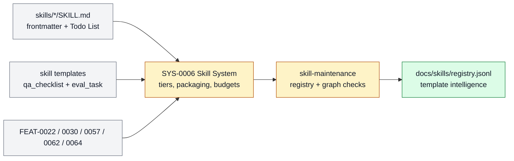

# Skill System

The reusable expertise layer: skill tiers, packaging, templates, evals, QA checklists,
registry intelligence, and maintenance constraints. This page is the product-layer owner
for that subsystem: it explains what belongs here, which feature specs make up the
stack, and where adjacent responsibilities should move.

```text
skill_system(change, repo_state?) -> owned_feature_set + boundary_decision + maintenance_signal
```

## At A Glance

- System ID: `SYS-0006`
- Status: `implemented`
- Primary feature: `FEAT-0022`
- Owner spec: `docs/systems/skill-system.md`
- Feature count: `5`

## Role

Skill System owns reusable expertise: skill packages, tiering, templates, local evals,
QA checklists, registry intelligence, and maintenance constraints. It lets Farplane add
capability without bloating the agent kernel.

The [Advisor System Index](../skills/advisors.md) is the human discovery view
for the cross-cutting advisor family inside this system. It does not create a
second registry or a separate formal subsystem: advisor package metadata stays
canonical in each skill and in the generated skill registry.

## Feature Docs

- [FEAT-0022 Skill tier leverage classes](../features/FEAT-0022-skill-tier-leverage-classes.md)
- [FEAT-0030 On-demand skill plugin packaging](../features/FEAT-0030-on-demand-skill-plugin-packaging.md)
- [FEAT-0057 Skill-local QA checklist artifacts](../features/FEAT-0057-skill-local-qa-checklist-artifacts.md)
- [FEAT-0062 Capped skill surface budget](../features/FEAT-0062-capped-skill-surface-budget.md)
- [FEAT-0064 Skill signals](../features/FEAT-0064-skill-signals.md)

## What Belongs Here

Skill authoring, tier/leverage classification, plugin packaging, QA checklists,
capped skill-surface budgets, skill signals, and skill registry maintenance.

## What Belongs Elsewhere

Always-loaded behavior belongs in Agent Kernel; task execution belongs in Work Loop;
domain-specific product workflows may live in Domain Skill Families.

## Operating Contract

- Skills are callable mini harnesses with clear inputs, outputs, and proof expectations.
- Detailed workflows stay skill-local where possible.
- Skill metadata, todo links, evals, and QA checklists remain validator-friendly.
- Installed copies are not the source of truth for repo-owned skills.
- Feature-level behavior belongs in `docs/features/FEAT-*.md`; this page owns the system boundary and feature grouping.
- Registry data is generated from system and feature docs, not edited by hand.
- When a capability no longer deserves a feature page, fold its current truth into the best owner and remove active refs.

## System Flow



The Skill System owns reusable workflow packaging, tier semantics, QA sidecars, budgets, and generated skill intelligence.

## Surfaces

- `docs/skills/README.md`
- `docs/skills/advisors.md`
- `docs/skills/system.md`
- `docs/skills/templates/SKILL_TEMPLATE.md`
- `skills/skill-maintenance/SKILL.md`

## Proof And Maintenance

- Registry proof: `python3 docs/features/validate_features.py`.
- Link proof: `python3 bin/validators/check_doc_refs.py`.
- Update this system page when product-layer boundaries or feature membership changes.
- Update feature pages when capability behavior changes.
- Regenerate registries and commit generated outputs with the source docs.

## Change History

- 2026-08-03: Added the grouped Advisor System index as a human discovery
  surface backed by the generated skill registry.
- 2026-06-28: Added capped skill surface budget as a Skill System feature.
- 2026-06-27: Migrated into the reader-first system-spec shape.
- 2026-07-07: Moved skill-local eval task feature ownership into consolidated
  Farplane evals under Proof And Review.
