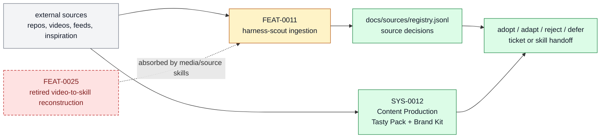

# Source And Sidecar Systems

The external-source, video-to-skill, and sidecar-product surfaces that let
Farplane adapt useful patterns without making them live dependencies. This page is the
product-layer owner for that subsystem: it explains what belongs here, which feature
specs make up the stack, and where adjacent responsibilities should move.

```text
source_and_sidecar_systems(change, repo_state?) -> owned_feature_set + boundary_decision + maintenance_signal
```

## At A Glance

- System ID: `SYS-0008`
- Status: `implemented`
- Primary feature: `FEAT-0011`
- Owner spec: `docs/systems/source-sidecar-systems.md`
- Feature count: `4`

## Role

Source And Sidecar Systems owns outside signal and decoupled capability organs: source scouting, media reconstruction, and sidecar systems that help Farplane learn without making every pattern a live dependency. Accepted creative reuse now belongs to [Content Production](content-production.md).

## Feature Docs

- [FEAT-0011 Harness scout source ingestion](../features/FEAT-0011-harness-scout-source-ingestion.md)
- [FEAT-0025 Video-to-skill source reconstruction](../features/FEAT-0025-video-to-skill-source-reconstruction.md)
- [FEAT-0072 Persistent ICP and world memory](../features/FEAT-0072-persistent-icp-and-world-memory.md)

## What Belongs Here

Harness scout ingestion, source scorecards, video-to-skill reconstruction, world-memory sidecars, and adopt/adapt/reject/defer decisions.

## What Belongs Elsewhere

Accepted capability contracts belong in feature specs; reusable procedures belong in skills; raw scratch research belongs in `tmp/` or bounded experiment artifacts. Computed Tasty Pack retrieval and Brand Kit approved creative identity belong in [Content Production](content-production.md).

## Operating Contract

- External sources become evidence-backed decisions before they change core behavior.
- Sidecars earn integration through proof, not architectural enthusiasm.
- Raw signal stays outside canonical docs until distilled.
- Creative source capture can feed Resource Bank candidates, but accepted creative reuse moves through Content Production.
- Decoupled organs expose proof gates and handoff boundaries.
- Feature-level behavior belongs in `docs/features/FEAT-*.md`; this page owns the system boundary and feature grouping.
- Registry data is generated from system and feature docs, not edited by hand.
- When a capability no longer deserves a feature page, fold its current truth into the best owner and remove active refs.

## System Flow



Source And Sidecar Systems let Farplane learn from outside material while keeping imported patterns visible and reviewed.

## Surfaces

- `docs/sources/registry.jsonl`
- `skills/harness-scout/SKILL.md`
- `skills/feed-scout/SKILL.md`
- `docs/features/FEAT-0072-persistent-icp-and-world-memory.md`
- `docs/systems/content-production.md`

## Proof And Maintenance

- Registry proof: `python3 docs/features/validate_features.py`.
- Link proof: `python3 bin/validators/check_doc_refs.py`.
- Update this system page when product-layer boundaries or feature membership changes.
- Update feature pages when capability behavior changes.
- Regenerate registries and commit generated outputs with the source docs.

## Change History

- 2026-07-22: Moved Tasty Pack creative reuse ownership to Content Production while keeping raw source and sidecar ownership here.
- 2026-07-14: Added persistent ICP and world memory as the compact current-context handoff from sources to planning.
- 2026-06-27: Migrated into the reader-first system-spec shape.
