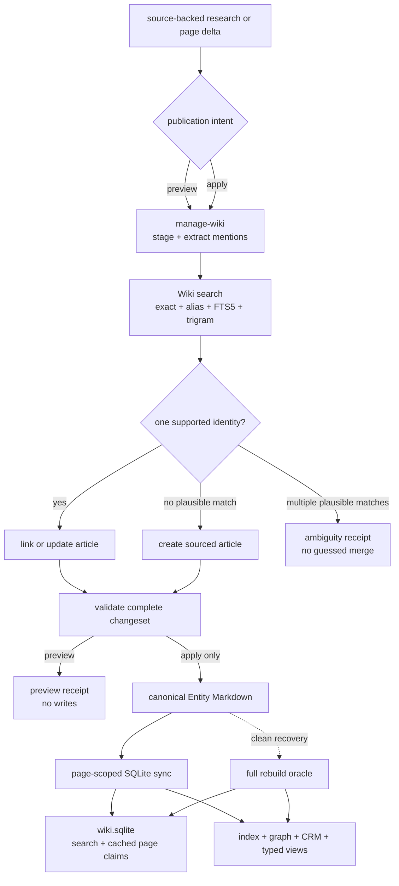

# Wiki

Wiki is Farplane's project-local knowledge system. Each durable entity is a
human-readable Markdown article; explicit entity links make those articles a
knowledge graph without moving canonical truth into a database or generated
JSON.

```text
wiki(source_ref, publication_intent = preview, project_context?)
  -> staged_or_changed_articles + resolution_receipt + projection_refs
```

## At A Glance

- System ID: `SYS-0014`
- Status: `implemented`
- Primary feature: `FEAT-0075`
- Owner spec: `docs/systems/wiki.md`
- Feature count: `4`
- Canonical source: `.farplane/entities/<id>.md` and optional
  `.farplane/views.yaml`
- General mutation workflow: `manage-wiki`
- Generated search state: `.farplane/wiki/wiki.sqlite`

## System Boundary

Wiki owns:

- canonical entity articles and their authoring notation;
- source-bounded article updates and entity creation;
- mention extraction, identity resolution, ambiguity handling, and entity-link
  insertion;
- exact, alias, FTS5 lexical, and trigram candidate retrieval;
- cached parsed pages and edge claims owned by their originating article;
- Wiki graph, bounded index, CRM, and typed-view JSON projections.

[Graph Systems](graph-systems.md) owns harness GraphIR and the common graph
vocabulary used to reason about projections. It does not own Wiki articles,
identity resolution, or Wiki generated state. Reports remain dated evidence
owned by their producing workflow; they may reference Wiki entities but do not
replace canonical articles.

## Feature Docs

- [FEAT-0075 Entity Markdown and Wiki graph projection](../features/FEAT-0075-entity-markdown-and-wiki-graph-projection.md)
- [FEAT-0076 Typed entity view projections](../features/FEAT-0076-typed-entity-view-projections.md)
- [FEAT-0077 CRM entity projection](../features/FEAT-0077-crm-entity-projection.md)
- [FEAT-0079 Wiki resolution and incremental projections](../features/FEAT-0079-wiki-resolution-and-incremental-projections.md)

## Canonical Terms

| Term | Meaning |
| --- | --- |
| Wiki article | Canonical `.farplane/entities/<id>.md` file for one project-local entity |
| Entity link | `[label](entity:<id>)`; an authored relationship in article prose |
| Identity reference | A frontmatter `*_ref` or `*_refs` field used for validation and lookup; it is not a graph edge |
| Resolution | Choosing `link`, `update_existing`, `create_new`, `ambiguity`, `skip_source_gap`, or `blocked` for a mention |
| Candidate | A possible identity returned by lexical search; candidates are not automatic merges |
| Originating article | The article whose prose authored a claim or outgoing edge |
| Publication intent | `preview` stages and validates without writes; `apply` authorizes a valid complete changeset to publish and sync |
| Wiki database | Rebuildable SQLite cache and search projection, never canonical storage |
| Clean rebuild | Full parse of canonical Markdown; the recovery oracle for generated state |

## Operating Contract

`manage-wiki` is the sole general mutation workflow:

```text
manage_wiki(source_ref, publication_intent = preview, page_deltas?, entity_scope?, project_root?)
  -> staged_pages + changed_pages + resolution_receipt + projection_refs
```

Callers derive publication intent from the operator's request. Explicit
“save/add/update/write/publish … Wiki” or “apply these Wiki changes” means
`apply`. “Preview/propose/draft/show Wiki changes”, an explicit no-write
instruction, or no Wiki-write direction means `preview`. Conflicting intent
never silently applies. A direct Wiki-write request is sufficient publication
authority; a report, offer, or outreach approval is not Wiki intent.

Both modes stage source-backed article changes, extract unlinked mentions from
the touched articles, ask Core for candidates, read plausible canonical articles,
and choose a resolution outcome. Only one unique exact ID, normalized name, or
alias match may auto-link. FTS5 and trigram matches are candidates: kind,
location, nearby entities, article context, and source evidence must still
support the decision. Multiple plausible candidates produce `ambiguity`; weak
evidence produces `skip_source_gap` or `blocked`, not a guessed merge.

After all mentions resolve or receive an explicit non-link outcome, the
workflow inserts entity links and validates the whole changeset. `preview`
returns the staged pages, decisions, and expected commands without changing
canonical or generated state. `apply` commits canonical Markdown and syncs only
touched or deleted pages. Core replaces cached records and edge claims owned by
those pages and exports the JSON projections; inbound claims authored by other
articles remain intact. Source, privacy, ambiguity, and validation gates block
writes in either mode.

Normal Wiki authoring does not require `impl-plan`: Manage Wiki chooses which
articles to update or create and which mentions to link. Software changes to
Wiki itself remain ticketed engineering work.

Generated state is fail-closed. Missing FTS5 or trigram support, invalid
Markdown, unresolved links, invalid view configuration, or a failed changeset
must not partially replace the database or JSON projections.

## Commands And Recovery

```bash
farplane wiki doctor --project-root <project>
farplane wiki search "Open AI" --project-root <project> --kind company
farplane wiki sync --project-root <project> --path .farplane/entities/georgia-power.md
farplane wiki rebuild --project-root <project>
```

- `doctor` checks the executing Python SQLite version, FTS5, trigram tokenizer,
  database path, database presence, schema version, and staleness without
  mutation. `ready` reports required runtime support; database state is
  reported separately.
- `search` returns ranked project-local candidates and may filter by `kind`.
- `sync` reparses specified changed or deleted article paths and replaces only
  their generated page state and originating edge claims. Without `--path`, it
  syncs every detected change. With one or more `--path` flags, it limits work
  to that set; any other dirty article keeps search stale until a later sync.
- `rebuild` deletes no canonical knowledge; it reconstructs generated state
  from all article and view sources and is the recovery and equivalence oracle.
- Mutating commands support `--no-write` for validation and `--json` for
  machine-readable diagnostics. `doctor` and `search` support `--json`.

Run `doctor` before the first rebuild in a new runtime. If the database is
missing, stale, or suspect, run `rebuild`; never repair SQLite rows or generated
JSON by hand.

## System Flow



## Surfaces

- `skills/manage-wiki/SKILL.md`
- `bin/core/farplane_wiki.py`
- `bin/core/farplane_wiki_store.py`
- `bin/core/farplane_entities.py`
- `docs/farplane-framework/entities.md`
- `docs/farplane-framework/entity-markdown-authoring.md`
- `.farplane/entities/<id>.md`
- `.farplane/views.yaml`
- `.farplane/wiki/wiki.sqlite` (generated)
- `.farplane/entities/index.json` (generated)
- `.farplane/entities/graph.json` (generated)
- `.farplane/entities/crm.json` (generated)
- `.farplane/views/<view-id>.json` (generated)

## Proof And Maintenance

- Wiki Core proof: `python3 -m unittest bin/tests/test_farplane_wiki.py`.
- Entity projection proof: `python3 -m unittest bin/tests/test_farplane_entities.py`.
- Registry proof: `python3 docs/features/validate_features.py`.
- Link proof: `python3 bin/validators/check_doc_refs.py`.
- Incremental acceptance requires the same exported JSON as a clean rebuild.
- Update this system when canonical ownership, resolution rules, generated
  search state, lifecycle commands, or feature membership changes.

## Limits And Non-Goals

- Identity is project-local; equal IDs in different projects do not imply one
  cross-project canonical entity.
- No vector database, graph database, hosted synchronization, or Wiki UI.
- No inferred predicates, automatic ambiguous merge, or entity creation
  without adequate source evidence.
- SQLite accelerates retrieval and page-scoped projection updates; it is not a
  second writable entity store.

## Change History

- 2026-08-19: Made Wiki the sole operator-facing knowledge term, renamed its
  generic export to `graph.json`, and added explicit preview/apply intent.
- 2026-08-19: Created `SYS-0014`, moved entity authoring and projections under
  Wiki ownership, and documented deterministic resolution, FTS5 search,
  originating-page edge replacement, and rebuild recovery.
