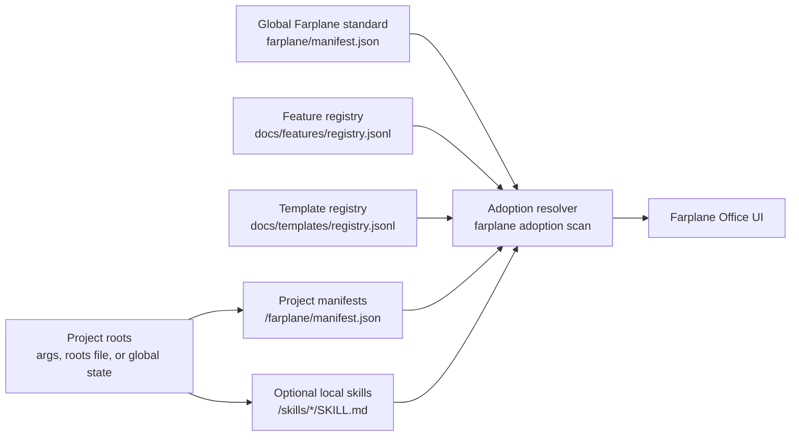
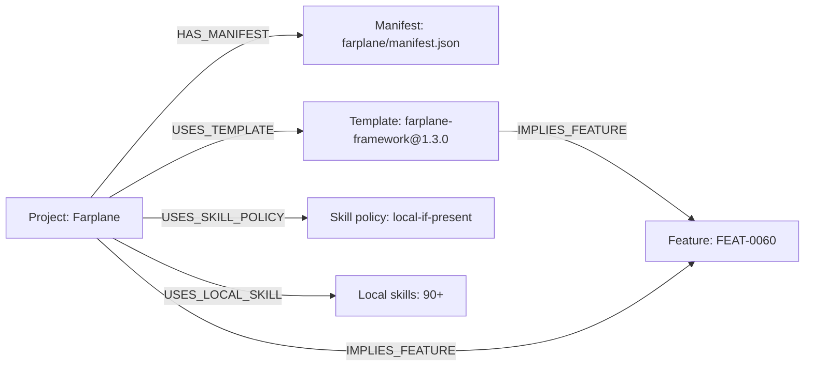

# Farplane UI Handoff: Adoption Tracker

## Reader Contract

This is the handoff for building the Farplane Office UI surface around harness
adoption and rollout status.

The UI should treat the CLI resolver output as the source of computed truth:

```text
farplane_adoption_scan(project_roots, standard_root, registries)
  -> project_manifest_matrix + feature_adoption_stats + drift_report
```

The UI owns rendering, filtering, navigation, empty states, and project-root
selection. The CLI owns resolving manifests, registries, local skill presence,
feature pins, implied feature adoption, and drift.

## What Was Built

Two related pieces now exist:

1. Configurable graph projections

   `skills/skill-maintenance` now has a shared GraphIR layer and projection
   profiles. This makes lifecycle, harness, and skill graphs sibling
   projections over one normalized graph representation instead of separate
   one-off graph builders.

   Main entry points:

   - `skills/skill-maintenance/scripts/graph_ir.py`
   - `skills/skill-maintenance/scripts/graph_projection.py`
   - `skills/skill-maintenance/scripts/graph_projection_config.py`
   - `skills/skill-maintenance/scripts/generate_graph_projection.py`
   - `skills/skill-maintenance/graph/README.md`

2. Farplane adoption tracker CLI

   The CLI resolves one global Farplane standard plus many project manifests
   into rollout stats and drift. It is available through:

   ```bash
   python3 bin/farplane.py adoption scan --project-root . --no-state --json
   python3 bin/farplane_adoption.py scan --project-root . --no-state --json
   ```

   Main entry points:

   - `bin/farplane_adoption.py`
   - `bin/farplane.py`
   - `bin/test_farplane_adoption.py`
   - `docs/features/registry.jsonl`
   - `docs/templates/registry.jsonl`
   - `farplane/manifest.json`

## System Model

Farplane now has one global standard and many project declarations.



The current product decision is:

- Farplane core owns the global manifest and registries.
- Each project may declare adoption through `farplane/manifest.json`.
- Each project may have local skills under `skills/`.
- If local skills exist, the project is counted as `usesLocalSkills=true`.
- If local skills do not exist, the project is assumed to use global skills.
- Office reads the computed adoption output and presents rollout health.

## CLI Contract

Use the wrapped command from the repo root:

```bash
python3 bin/farplane.py adoption scan --project-root . --no-state --json
```

Useful variants:

```bash
python3 bin/farplane.py adoption scan --roots-file ~/.farplane/state/projects.json --json
python3 bin/farplane.py adoption scan --project-root /path/to/project-a --project-root /path/to/project-b --json
python3 bin/farplane_adoption.py scan --standard-root /path/to/Farplane --roots-file /path/to/projects.json --json
```

The UI can shell out to this command for v1. That keeps the resolver logic in
one Python implementation while the UI proves which views are actually useful.

## Input Contract

### Project Root Sources

The scanner accepts explicit roots, a roots file, or global state discovery.

For Office, the recommended v1 path is to pass the roots the UI already knows:

```bash
python3 bin/farplane.py adoption scan --roots-file <office-project-roots.json> --json
```

Accepted roots file shapes include:

```json
[
  "/path/to/project-a",
  "/path/to/project-b"
]
```

```json
{
  "projectRoots": [
    "/path/to/project-a",
    "/path/to/project-b"
  ]
}
```

```json
{
  "projects": [
    { "projectRoot": "/path/to/project-a" },
    { "path": "/path/to/project-b" }
  ]
}
```

Project objects may use `root`, `path`, `projectRoot`, `project_root`,
`directory`, or `projectDirectory`.

### Project Manifest

Each participating project can include:

```text
<project-root>/farplane/manifest.json
```

The resolver currently reads these concepts:

- `schema`
- `spec_version`
- `template_uses`
- `feature_pins`
- `skillSourcePolicy` or equivalent skill policy fields

Projects without a manifest are still reported, but `manifestExists=false` and
`ok=false`.

### Local Skills

The resolver checks:

```text
<project-root>/skills/*/SKILL.md
```

The UI should treat local skills as a project-level capability signal, not as a
requirement. A project can be a valid Farplane project without local skills.

## Output Contract

The scanner emits JSON with this top-level shape:

```json
{
  "schema": "farplane_adoption_stats",
  "schemaVersion": "0.1.0",
  "standardRoot": "/path/to/Farplane",
  "globalManifestPath": "/path/to/Farplane/farplane/manifest.json",
  "globalSpecVersion": "1.3.0",
  "globalTemplateUses": {
    "farplane-framework": "1.3.0"
  },
  "featureRegistryPath": "/path/to/docs/features/registry.jsonl",
  "templateRegistryPath": "/path/to/docs/templates/registry.jsonl",
  "counts": {},
  "projects": [],
  "features": {},
  "rootSources": []
}
```

### `counts`

```json
{
  "projects": 1,
  "manifests": 1,
  "projectsWithLocalSkills": 1,
  "driftItems": 0
}
```

Suggested UI cards:

- projects scanned
- manifests found
- projects with local skills
- drift items

### `projects[]`

Each project row includes:

```json
{
  "root": "/path/to/project",
  "manifestPath": "/path/to/project/farplane/manifest.json",
  "manifestExists": true,
  "ok": true,
  "projectId": "Farplane",
  "schema": "farplane_project",
  "specVersion": "1.3.0",
  "expectedSpecVersion": "1.3.0",
  "templateUses": {
    "farplane-framework": "1.3.0"
  },
  "featurePins": {},
  "impliedFeaturePins": {
    "FEAT-0060": ["farplane-framework"]
  },
  "localSkills": ["documentation", "goal-advisor"],
  "usesLocalSkills": true,
  "skillSourcePolicy": "local-if-present",
  "issues": [],
  "drift": []
}
```

Suggested UI table columns:

- project id
- manifest status
- spec version
- template pins
- explicit feature pins
- implied feature pins
- local skills count
- drift count

### `features`

Feature adoption is keyed by feature id:

```json
{
  "FEAT-0060": {
    "id": "FEAT-0060",
    "name": "High-impact template feature registry",
    "status": "implemented",
    "explicitProjects": [],
    "impliedProjects": ["Farplane"],
    "projectCount": 1
  }
}
```

Suggested UI views:

- feature adoption matrix
- feature detail drawer
- explicit versus implied adoption badges
- project count by feature

## Current Example Output

This is the current scan against this repo:

```bash
python3 bin/farplane.py adoption scan --project-root . --no-state --json
```

Compact result:

```json
{
  "schema": "farplane_adoption_stats",
  "schemaVersion": "0.1.0",
  "counts": {
    "driftItems": 0,
    "manifests": 1,
    "projects": 1,
    "projectsWithLocalSkills": 1
  },
  "globalSpecVersion": "1.3.0",
  "globalTemplateUses": {
    "farplane-framework": "1.3.0"
  },
  "features": {
    "FEAT-0060": {
      "id": "FEAT-0060",
      "name": "High-impact template feature registry",
      "status": "implemented",
      "explicitProjects": [],
      "impliedProjects": ["Farplane"],
      "projectCount": 1
    }
  },
  "projects": [
    {
      "projectId": "Farplane",
      "ok": true,
      "specVersion": "1.3.0",
      "expectedSpecVersion": "1.3.0",
      "templateUses": {
        "farplane-framework": "1.3.0"
      },
      "featurePins": {},
      "impliedFeaturePins": {
        "FEAT-0060": ["farplane-framework"]
      },
      "usesLocalSkills": true,
      "skillSourcePolicy": "local-if-present",
      "issues": [],
      "drift": []
    }
  ],
  "rootSources": ["arg"]
}
```

`FEAT-0061` exists in the feature registry for this adoption tracker work, but
it will not appear in the adoption output until a manifest explicitly pins it or
a template implies it.

## Recommended UI Surfaces

### 1. Adoption Overview

Top-level cards from `counts`:

- projects scanned
- manifests found
- projects with local skills
- drift items

This answers: "Is the workspace adopting Farplane cleanly?"

### 2. Project Adoption Table

Rows from `projects[]`.

Important states:

- `ok=true`: manifest exists and no drift or issues were found.
- `manifestExists=false`: project root is known, but not a Farplane project yet.
- non-empty `issues`: malformed or incomplete project input.
- non-empty `drift`: project is behind or pinned to unknown versions/features.

This answers: "Which projects are aligned, missing, or drifting?"

### 3. Feature Rollout Matrix

Rows from `features`.

Columns:

- feature id
- feature name
- registry status
- explicit project count
- implied project count
- total project count
- project list

This answers: "Which Farplane features are adopted across projects?"

### 4. Local Skills Panel

Rows from `projects[].localSkills`.

Useful filters:

- projects with local skills
- projects using only global skills
- top local skill names across projects

This answers: "Where are teams experimenting locally before promotion?"

### 5. Drift Panel

Rows from `projects[].drift` and `projects[].issues`.

Suggested grouping:

- spec version drift
- template version drift
- unknown feature refs
- missing manifests
- malformed manifests

This answers: "What needs attention before rollout is trustworthy?"

## Graph Projection For UI

The adoption output can be rendered as a simple graph. This does not need to
replace the skill graph. It is a projection over project adoption state.

Suggested graph node types:

- `project`
- `manifest`
- `template`
- `feature`
- `skill_policy`
- `local_skill`

Suggested edge types:

- `HAS_MANIFEST`: project -> manifest
- `USES_TEMPLATE`: project -> template
- `EXPLICITLY_PINS_FEATURE`: project -> feature
- `IMPLIES_FEATURE`: template -> feature and project -> feature
- `USES_LOCAL_SKILL`: project -> local_skill
- `USES_SKILL_POLICY`: project -> skill_policy

Example:



Relationship to the existing skill graph:

- The skill graph explains skill packages and invocation relationships.
- The adoption graph explains which projects adopt Farplane standards,
  templates, features, and local skill policy.
- They can share GraphIR concepts, but adoption graph should stay a projection,
  not become the owner of skill metadata.

## V1 Implementation Recommendation

Build the first UI version by shelling out to the CLI:

```text
load_project_roots_from_office()
  -> write_temp_roots_file()
  -> run("python3 bin/farplane.py adoption scan --roots-file <file> --json")
  -> parse_json()
  -> render_overview_table_graph()
```

This avoids duplicating resolver rules in the UI. If the UI later needs a
native backend adapter, port the resolver only after the v1 views prove stable.

## Known Limits

- The scanner does not crawl the whole computer.
- Rollout percentages are only meaningful once multiple project roots are
  supplied.
- There is no historical snapshot store yet.
- There are no adopted-at timestamps yet.
- `FEAT-0061` is registered but not shown as adopted until a manifest pins it
  or a template implies it.
- The scanner does not mutate project manifests.
- Local skills are counted by folder presence and `SKILL.md`, not scored for
  quality or compatibility.

## Future Additions

Add only after the Office UI proves the v1 surface is useful:

- snapshot history under `.farplane/state/adoption-snapshots/*.json`
- rollout percentage by feature and template
- project owner/team grouping
- canary or forward-facing project marker
- stale local skill detection
- promotion candidates from local skills into global skill standards
- GraphIR export profile for adoption graph rendering

## Verification

The current implementation was verified with:

```bash
python3 -m py_compile bin/farplane_adoption.py bin/farplane.py
python3 -m unittest bin/test_farplane_adoption.py
python3 bin/farplane.py adoption scan --project-root . --no-state --json
python3 bin/validators/check_doc_refs.py
git diff --check
```

The current scan returns:

- `projects=1`
- `manifests=1`
- `projectsWithLocalSkills=1`
- `driftItems=0`
- global spec `1.3.0`
- global template `farplane-framework: 1.3.0`
- implied adoption of `FEAT-0060` by `Farplane`
