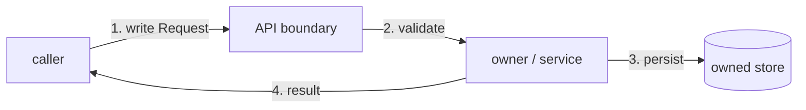
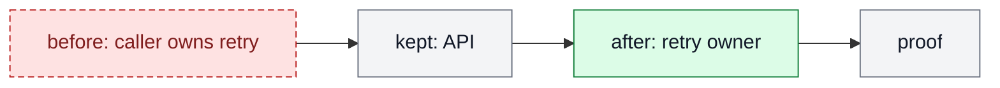

# Diagramming Patterns

Use this reference after `SKILL.md` identifies the reader's approval question.
Choose the form that makes that question inspectable; do not start from a
generic box-and-arrow chain.

## Form Selector

| Approval question | Form | Essential content | Avoid |
| --- | --- | --- | --- |
| What does each actor do next? | numbered sequence or swimlane | actor, action, handoff, success/failure | component inventory |
| What state follows this event? | state transition | state, trigger, recovery, terminal state | before/after maps |
| Who owns and moves this data? | boundary/data-flow map | caller, owner, store, direction, read/write | UI layout |
| What happens in a dry run? | numbered trace + decision branch | precondition, action, branch, observation | an unnumbered architecture map |
| How does the UI journey behave? | wireflow/state map | screen, action, transition, error/recovery | visual styling or pixel geometry |
| What changed in the system? | Before/After delta | removed, kept, changed, added, proof | unrelated flow detail |
| Which fields or options correspond? | table | keys, source, destination, rule | decorative arrows |

For a ticket Contract Diagram, a field-mapping table supplements rather than
replaces the required minimal directed ASCII path.

## 1. User / Action Sequence

```text
[U1] user --1. submit--> [S1] validate
[S1] --2. valid--> [A1] create record --> [P1] confirmation
[S1] --invalid--> [F1] inline error --edit--> [U1]
```

Use a swimlane when ownership changes often; otherwise a numbered sequence is
smaller. Keep only the action path the reader must approve.

## 2. State / Recovery Transition

```text
[S1] idle --start--> [S2] loading
[S2] --success--> [S3] complete
[S2] --failure--> [F1] error --retry--> [S2]
```

Use this for lifecycle, retry, empty/error, authorization, or recovery
questions. Events belong on arrows; states remain distinct nodes.

## 3. Boundary / Data-Flow Map



Add short signatures only when an interface shape decides the work, such as
`createOrder(input): OrderResult`. Show ownership and direction, not every
internal function.

## 4. Dry-Run / Decision Trace

```text
[S1] precondition: pending invoice
  --1. run reminder--> [A1] validate contact
  --2. contact present--> [A2] send --> [P1] delivery receipt
  --2. missing--> [F1] hold + reason
```

Number the operational order and keep the decision branch that changes the
outcome. This is often clearer than architecture for a workflow review.

## 5. UI Wireflow / State Map

```text
[S1] list --select item--> [S2] detail
[S2] --save--> [S3] saving
[S3] --success--> [S4] updated
[S3] --failure--> [F1] error --retry--> [S3]
```

Use it for interaction and state; route detailed screens, copy, geometry, and
visual assertions to `design.md`, `functional-ui`, and `visual-design`.

## 6. Before / After Delta

Use when the answer is “what changes?” rather than “what happens next?”



Legend: `red = removed/problem`, `gray = kept`, `green = added`. Use separate
Before and After maps only when a single delta map cannot make both states clear.

## 7. Zoom-In and Inline Signatures

Add one zoom-in only when a top-level boundary remains unresolved. Embed a short
signature inside a relevant node; do not turn a node into a type-definition
paragraph.

Good: `review / judge(plan): pass|revise`.

Bad: three methods, full fields, and unrelated invariants in one node.

## Impl-Plan Visual Companion

For a material `impl-plan` companion, use `ticket.md` as the only scope source
and write `tickets/TASK-XXXX/diagrams.md` with:

```yaml
status: companion
source: ticket.md
blocks_approval: false
canonical_contract: ticket.md
generated_by: diagramming
```

The companion requires a Mermaid `Before` and `After` pack with semantic
classes and legend because its job is explicitly a system delta. Add `What
Changed` or compact per-change-unit maps only when they answer another question.
Keep `ticket.md` canonical and do not make the companion a review gate unless
the caller requests one.

## Anti-Patterns

Fail the diagram if it:

- answers a different question than the reader needs resolved;
- has more diagrams than decisions;
- hides an important branch, owner, recovery, or proof point;
- uses paragraph labels or repeats the surrounding prose; or
- substitutes a pretty UI mockup for behavioral or visual-design work.
