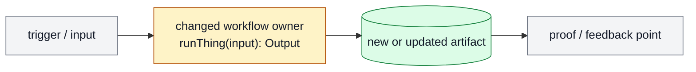
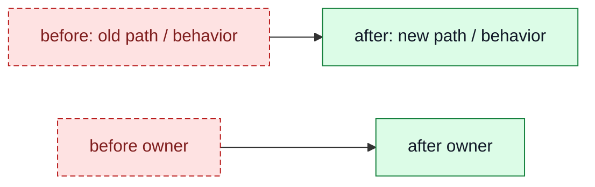
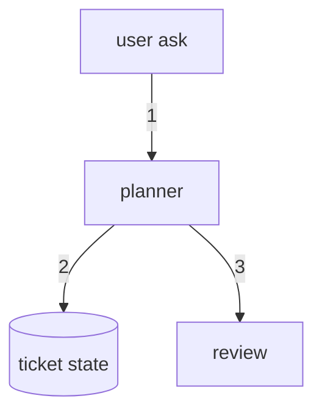

# Diagramming Patterns

Use these patterns when `SKILL.md` says a diagram is warranted.

## 1. Target Flow

Use when:

- the question is "what will the workflow look like after this lands?"
- the ticket spans multiple components
- the reader needs a fast approval surface

Pattern:



Legend:

- `gray = keep`
- `amber = change`
- `green = add`
- `red dashed = remove`

## 2. Before / After Delta

Use when:

- the question is "what changed?"
- the operator needs to compare old and new ownership, artifacts, or behavior
- the companion should avoid random supplementary diagrams

Pattern:



Rules:

- include the words `before` and `after` in the visible node labels
- show replacements, moves, or ownership changes directly
- do not create disconnected context diagrams unless they clarify the delta

## 3. Numbered Data-Flow Trace

Use when:

- the question is "how does data move?"
- ordering matters
- the system map alone is insufficient

Pattern:



Rules:

- keep only the critical path
- number the edges
- avoid side branches unless the branch is the point

## 4. Zoom-In

Use when:

- one subsystem remains unclear after the top-level map
- one interface cluster needs more detail

Rules:

- inherit the same legend/classes as the top-level map
- keep the zoom-in scoped to one subsystem
- do not redraw the whole system again

## 5. Inline Signatures

Use when:

- the function or interface is the important thing
- a detached list would make the reader scroll

Good:

- `planner / buildPlan(ticket): PlanArtifact`
- `state / claim.ticket_id: string`
- `review / judgePlan(plan): pass|fix`

Bad:

- full type definitions
- three-method classes stuffed into one node
- signatures that wrap across many lines

## 6. Impl-Plan Visual Companion

Use when:

- `impl-plan` has produced a material `ticket.md`
- the operator needs a diagram-first reading surface
- diagrams should stay out of the canonical ticket body

Output path:

```text
tickets/TASK-XXXX/diagrams.md
```

Required metadata:

```yaml
status: companion
source: ticket.md
blocks_approval: false
canonical_contract: ticket.md
generated_by: diagramming
```

Shape:

```text
VisualPlan(
  reading_order,
  target_flow,
  before_after_delta,
  change_unit_maps[]?,
  proof_map?,
  feedback_guide
)
```

Rules:

- use `ticket.md` as the only source of scope
- keep `ticket.md` free of Mermaid by default
- create one target-flow diagram and one before/after delta diagram
- create one compact map per material `Change Plan` unit only when the ticket
  has multiple units that are hard to compare from the top-level diagrams
- keep each unit map to 2-5 nodes plus short `writes`, `proof`, and `risk`
  notes
- include the `Proof Map` from `Done` and `QA Strategy` only when proof flow is
  not obvious
- do not make the companion a reviewer gate unless the caller explicitly asks
  for diagram review

## Anti-Patterns

Fail the diagram if:

- it has more diagrams than decisions
- it lacks an explicit before/after delta for an `impl-plan` companion
- the labels are paragraphs
- the legend is missing
- the diagram repeats the prose instead of compressing it
