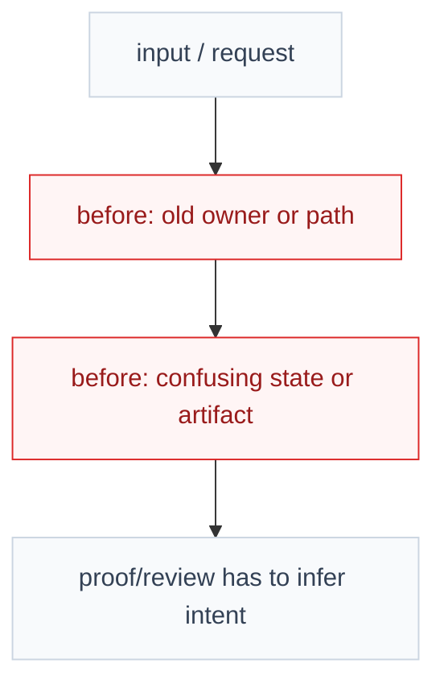
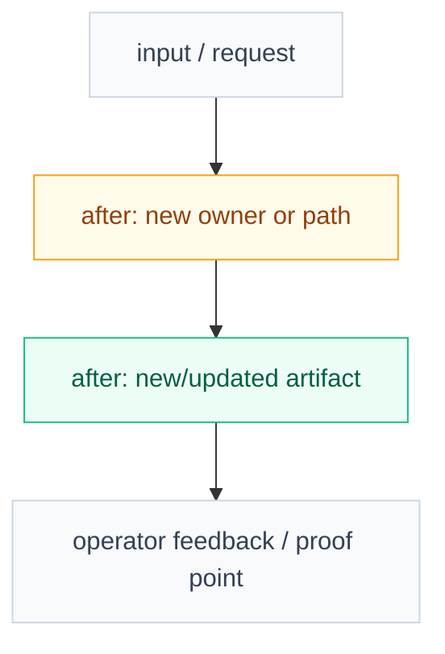
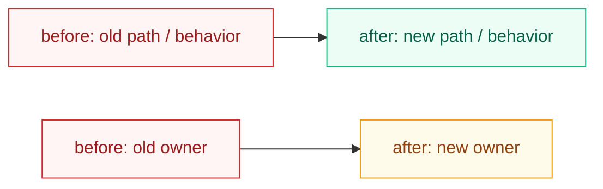
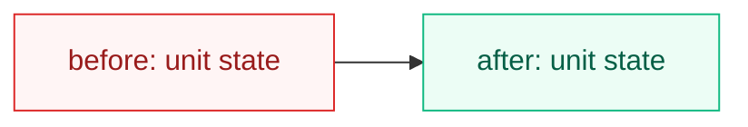

# Impl Plan Visual Companion Template

Use this template for the non-canonical visual companion generated after a
material `impl-plan` ticket exists.

The companion helps the operator read and give feedback. It does not replace
`ticket.md`, does not change scope, and does not block approval or review
unless the operator explicitly asks for diagram review.

````markdown
---
status: companion
source: ticket.md
blocks_approval: false
canonical_contract: ticket.md
generated_by: diagramming
generation_lane: background subagent when available; inline fallback allowed
---

# Visual Plan

## Reading Order
- Start with `Before` to see the current confusing or broken structure.
- Check `After` to see the target structure.
- Use `What Changed` for a compressed old-to-new summary.
- Give feedback against `Feedback Guide`.

## Before: `<current state in one sentence>`

Commentary: explain the current problem in one or two sentences. Say what is
confusing, duplicated, coupled, missing, or hard to prove.



Legend:
- red = current problem, removed default, or confusing ownership
- gray = existing flow that stays

## After: `<target state in one sentence>`

Commentary: explain the target shape in one or two sentences. Say what became
separate, simpler, newly owned, or easier to review.



Legend:
- green = added artifact or capability
- amber = changed owner, behavior, or routing
- gray = canonical flow kept

## What Changed

Diagram intent: show the concrete old-to-new replacement, move, or upgrade.



## Change Unit Maps

Use only when the ticket has multiple material `Change Plan` units and the
before/after sections are not enough. Keep each diagram small: 2-5 nodes, short
labels, and colored classes.



## Feedback Guide
- Is the before diagram honest about the old confusion?
- Is the after diagram clear about the new ownership or artifact?
- Are colored boxes enough to scan what changed?
- Is any change unit missing, unnecessary, or in the wrong order?
- Is there a scope change that must go back into `ticket.md`?
````
