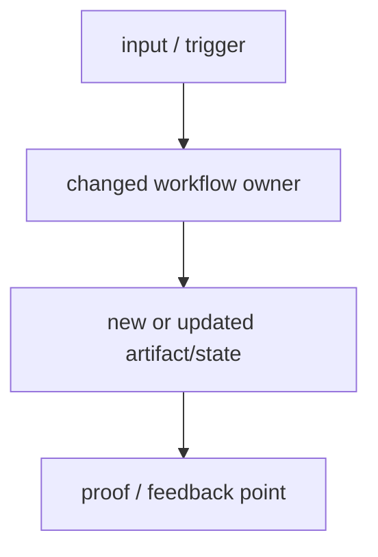
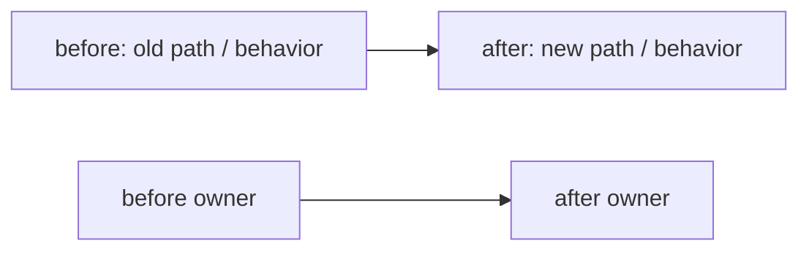
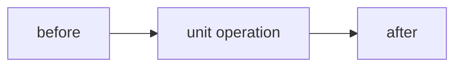
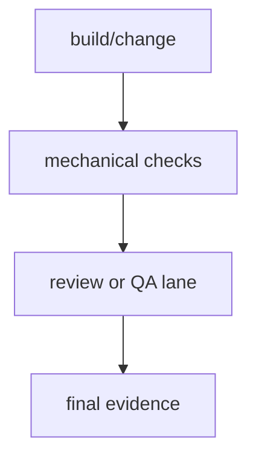

# Impl Plan Visual Companion Template

Use this template for the non-canonical visual companion generated after a
material `impl-plan` ticket exists.

The companion helps the operator read and give feedback. It does not replace
`ticket.md`, does not change scope, and does not block approval or review
unless the operator explicitly asks for diagram review.

````markdown
---
status: companion
source: ticket.md
blocks_approval: false
canonical_contract: ticket.md
generated_by: diagramming
generation_lane: background subagent when available; inline fallback allowed
---

# Visual Plan

## Reading Order
- Start with `Target Flow` to understand the intended lifecycle.
- Check `Before / After Delta` to see what is changing.
- Skim `Change Unit Maps` only when the ticket has multiple material units.
- Give feedback against `Feedback Guide`.

## Target Flow

Diagram intent: show the after-state workflow or lifecycle the ticket is trying
to create.



## Before / After Delta

Diagram intent: show the concrete old-to-new replacement, move, or upgrade.



Notes:
- `before:` current behavior, owner, artifact, or path
- `after:` target behavior, owner, artifact, or path
- `why:` the reader-facing reason this change matters

## Change Unit Maps

Use only when the ticket has multiple material `Change Plan` units. Keep each
diagram small: 2-5 nodes, short labels, and the unit's proof point. Omit this
section when `Target Flow` plus `Before / After Delta` already makes the ticket
legible.

### Change 1: `<same heading as ticket.md>`



Notes:
- `writes:` path(s)
- `proof:` check or review from the ticket unit
- `risk:` main failure mode

## Proof Map

Use only when proof flow is not obvious from `Done` and `QA Strategy`.



## Feedback Guide
- Is the target flow right?
- Is the before/after delta accurate?
- Is any change unit missing, unnecessary, or in the wrong order?
- Is there a scope change that must go back into `ticket.md`?
````
