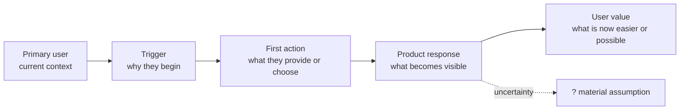
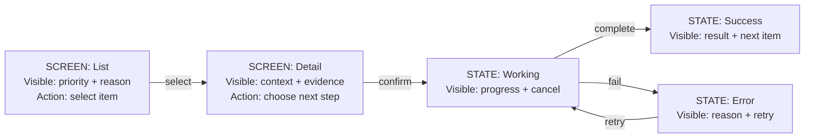
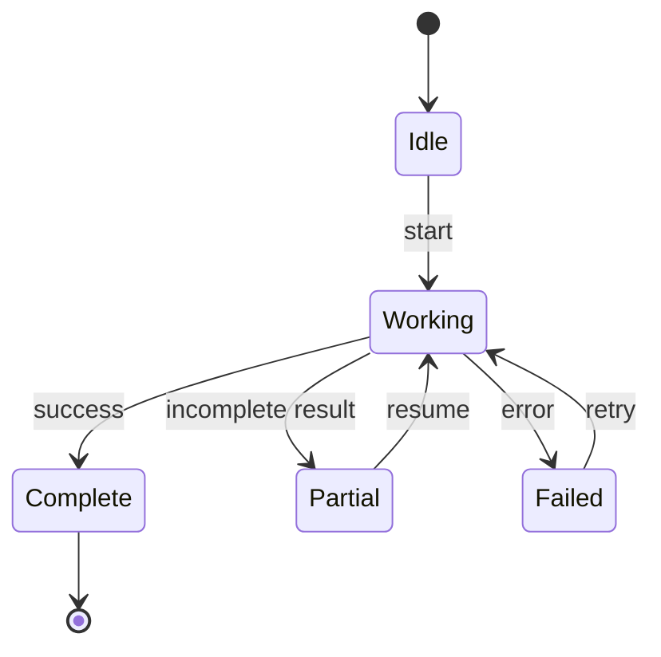
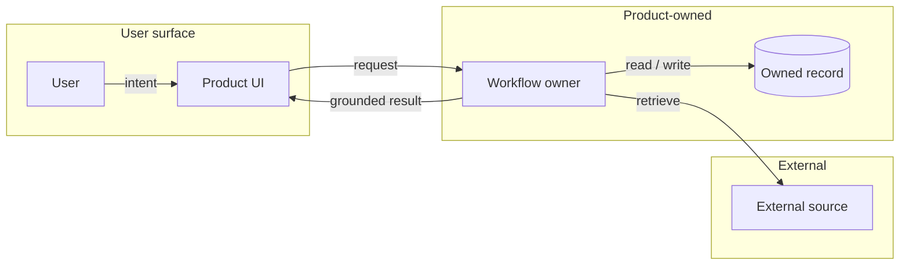
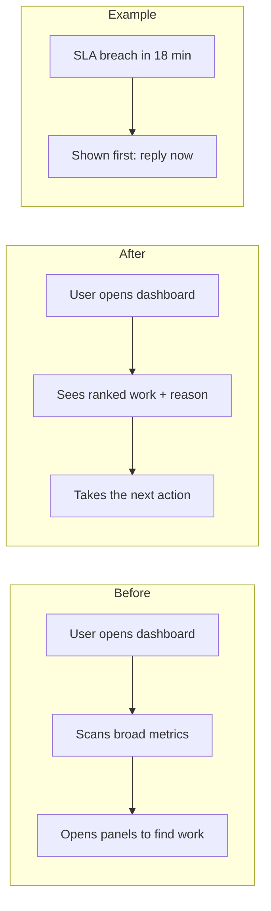

# Recap Idea Visual Templates

Load this only after `SKILL.md` has classified the product shape. Choose one
template, replace every placeholder with discussion-grounded content, and
remove irrelevant branches. The template is scaffolding, never visible filler.

## Selector

| Template ID | What is being built | Reader checks | Do not substitute |
| --- | --- | --- | --- |
| `journey` | end-to-end product experience | trigger through user value | component inventory |
| `ui-screen-flow` | screen, interaction, or UI design | what the user sees, does, and sees next | backend architecture |
| `lifecycle` | stateful or recoverable behavior | events, failure, retry, terminal state | generic flowchart |
| `system-boundary` | service, ownership, or information flow | who owns and moves what | UI wireflow |
| `before-after-example` | an existing behavior being changed | concrete experiential delta | generic journey |
| `comparison-table` | exact options, fields, or mappings | correspondence and decision rule | decorative arrows |

When two templates seem plausible, use the operator's verification question as
the tie-breaker. A redesign asking “what will users see?” is `ui-screen-flow`;
the same redesign asking “what changed?” is `before-after-example`.

## `journey`

Use for a new product or end-to-end experience.

## `ui-screen-flow`

Use for UI or design discussions. Screen nodes contain user-visible information
and controls, not implementation components. Put the concrete example directly
inside those nodes; never append an ASCII wireframe or separate screen mockup.

## `lifecycle`

Use when state and recovery are the product question.

## `system-boundary`

Use when ownership or information movement is what needs confirmation.

## `before-after-example`

Use only for a real change to an existing experience. The example trace proves
the delta in a concrete case rather than adding a third abstract diagram.

## `comparison-table`

Use when exact correspondence matters more than direction.

| Item | Current meaning | Proposed meaning | Decision or uncertainty |
| --- | --- | --- | --- |
| `[term / field / option]` | `[observed]` | `[intended]` | `[confirmed / ?]` |

## Template Check

- Does the selected template match what is being built and what the operator
  must verify?
- Did every placeholder become a concrete product noun, action, state, or
  uncertainty from the discussion?
- Can the operator spot the likely misunderstanding from the visual alone?
- Is there one primary visual and no duplicate ASCII rendering?
- For UI, is every concrete screen example inside the Mermaid nodes rather than
  repeated in another format?
