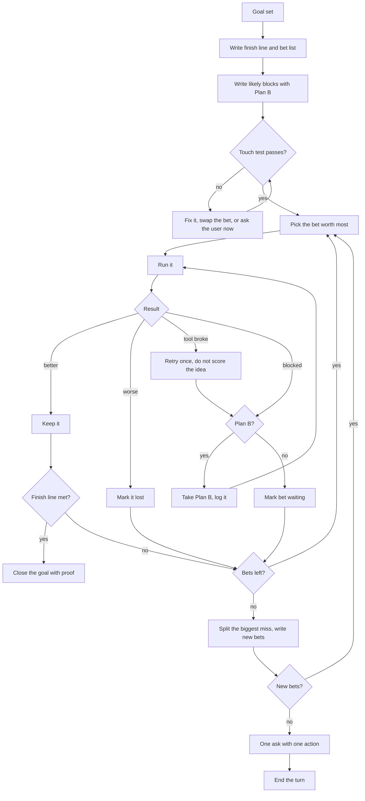

# Unblock Map

The loop in `SKILL.md`, drawn for a reader. The skill owns the rules.

```mermaid
flowchart TD
  A[Goal set] --> B[Write finish line and bet list]
  B --> C[Write likely blocks with Plan B]
  C --> D{Touch test passes?}
  D -- no --> E[Fix it, swap the bet, or ask the user now]
  E --> D
  D -- yes --> F[Pick the bet worth most]
  F --> G[Run it]
  G --> H{Result}
  H -- better --> I[Keep it]
  H -- worse --> J[Mark it lost]
  H -- tool broke --> K[Retry once, do not score the idea]
  H -- blocked --> L{Plan B?}
  K --> L
  L -- yes --> M[Take Plan B, log it]
  L -- no --> N[Mark bet waiting]
  M --> G
  I --> O{Finish line met?}
  O -- yes --> P[Close the goal with proof]
  O -- no --> Q{Bets left?}
  J --> Q
  N --> Q
  Q -- yes --> F
  Q -- no --> R[Split the biggest miss, write new bets]
  R --> S{New bets?}
  S -- yes --> F
  S -- no --> T[One ask with one action]
  T --> U[End the turn]
```
