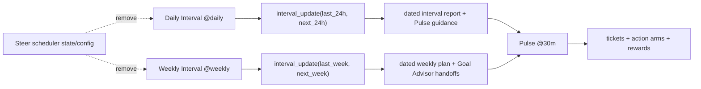

# TASK-0214 Flatten Steer Into Explicit Interval Automations

## Summary

Replace the Steer-orchestrator automation model with a simpler Farplane runtime:
Pulse acts frequently, Daily Interval reports and plans the last/next 24 hours,
and Weekly Interval reports and plans the last/next week. Keep the useful
`interval_update` contract, but remove the hidden Steer scheduler/state story
from active docs, templates, and automation prompts.

## Scope

- `In:`
  - Update the Farplane automation prompt source to define Pulse, Daily
    Interval, and Weekly Interval.
  - Reframe `steer-update` or its replacement so interval planning is a direct
    callable workflow, not an orchestrator that selects due jobs.
  - Update automation-advisor, deep-init templates, lifecycle/spec docs, and
    generated skill registries/graphs.
  - Remove or retire `farplane/steer.config.toml` as active scheduler config.
- `Out:`
  - Creating or mutating live Codex app automations unless explicitly needed by
    the implementation proof.
  - Changing Pulse ticket bandit behavior beyond naming its relationship to
    interval reports.
  - Farplane Office UI rendering changes.

## Delta

- `Before:` Farplane active docs describe two loops: Pulse and Steer. Steer is
  a scheduler/orchestrator that reads scheduler state, decides due jobs, and
  runs internal daily/weekly interval jobs.
- `After:` Farplane active docs describe explicit clocks: Pulse, Daily
  Interval, and Weekly Interval. Each interval automation runs the interval
  report-then-plan workflow directly. Shared memory is file-backed reports and
  ledgers, not Steer thread continuity.
- `Why now:` The Steer-orchestrator layer is creating decision fog around what
  is due and why. The simpler flat model is easier to inspect, edit, schedule,
  and render in Farplane Office.
- `First-principles basis:` The objective is autonomous project progress with
  visible state. The core separation is action versus planning, not scheduler
  nesting. Since interval reports are durable files, daily/weekly planning does
  not need a parent Steer context thread.

## Program

```text
signature:
  flatten_steer_to_intervals(project_root, current_docs, current_skills)
    -> automation_prompt_delta + skill_delta + docs_delta + registry_delta + proof

vars:
  project_root = /Users/kenjipcx/Zanarkand Technologies/projects/Farplane
  interval_model = [pulse_beat, daily_interval, weekly_interval]
  retired_model = steer_scheduler

program:
  ground(vars) -> current_surface_map
  create_or_refactor_interval_skill(current_surface_map) -> direct_interval_contract
  update_automation_prompts(direct_interval_contract) -> three_prompt_blocks
  update_framework_docs(three_prompt_blocks) -> flat_lifecycle_story
  remove_scheduler_config_refs() -> no_active_steer_config_dependency
  regenerate_skill_registries() -> registry_delta
  verify(done_when, proof) -> evidence
```

## Map



- `Touch:`
  - `farplane/automations.md`
  - `farplane/steer.config.toml` or replacement/removal
  - `skills/steer-update/**` or a direct interval skill package
  - `skills/automation-advisor/**`
  - `skills/deep-init-project/references/*AUTOMATION*`
  - `docs/specs/steer-pulse-automation.md` or renamed replacement
  - `docs/farplane-framework/*`
  - generated registries/graphs
- `Inspect:`
  - `skills/pulse-update/SKILL.md`
  - `docs/MEMORY.md`, `docs/LESSONS.md`, `docs/TROUBLES.md`
  - `docs/skills/registry.jsonl`

## Done / Proof

```text
done_when:
  - Active automation docs define Pulse, Daily Interval, and Weekly Interval.
  - Active docs no longer describe Steer as a scheduler thread with cached due
    jobs.
  - Interval update remains a reusable report-before-plan workflow.
  - Deep-init and automation-advisor templates produce the flat model.
  - Generated skill registry and graphs match the active skill packages.

proof:
  checks:
    - python3 -m json.tool skills/*/eval_task.json for touched evals
    - python3 skills/skill-maintenance/scripts/check_skills.py --write
    - python3 skills/skill-maintenance/scripts/generate_skill_graph.py
    - python3 skills/skill-maintenance/scripts/generate_harness_graph.py
    - python3 bin/validators/check_doc_refs.py
    - python3 bin/validators/check_farplane_project_files.py
    - PYTHONPATH=. uvx pytest bin/validators/test_check_farplane_project_files.py
    - git diff --check
  manual:
    - rg confirms active docs/templates do not reference Steer scheduler state
      as required automation runtime.
    - registry contains the active interval/Pulse skill surface and not a
      confusing hidden scheduler story.
  review:
    - rubric: none mechanical
      required_tas: none
  evidence:
    - command outputs summarized in `progress.md`
    - changed files visible in git diff
```

## State

- `next_action:` complete.
- `blocked:` no.
- `latest_verification:` `python3 skills/skill-maintenance/scripts/check_skills.py --write`;
  `python3 bin/validators/check_farplane_project_files.py`;
  `python3 bin/validators/check_doc_refs.py`;
  `PYTHONPATH=. uvx pytest bin/validators/test_check_farplane_project_files.py skills/skill-maintenance/scripts/test_generate_farplane_lifecycle_graph.py`;
  `git diff --check`.

## Links

- `program:` [program.md](program.md)
- `progress:` [progress.md](progress.md)
- `refs:`
  - [docs/specs/steer-pulse-automation.md](../../docs/specs/steer-pulse-automation.md)
  - [farplane/automations.md](../../farplane/automations.md)
  - [skills/interval-update/SKILL.md](../../skills/interval-update/SKILL.md)
  - [skills/pulse-update/SKILL.md](../../skills/pulse-update/SKILL.md)

## Notes

- `Blast radius:` prompt/docs/skill registry behavior only; no product runtime
  code expected.
- `Risks / rollback:` if `steer-update` rename is too invasive, preserve the
  package name temporarily but rewrite its contract as direct interval update.
- `Follow-ups:` live Codex automation records can be updated after the
  versioned prompt source is accepted.
