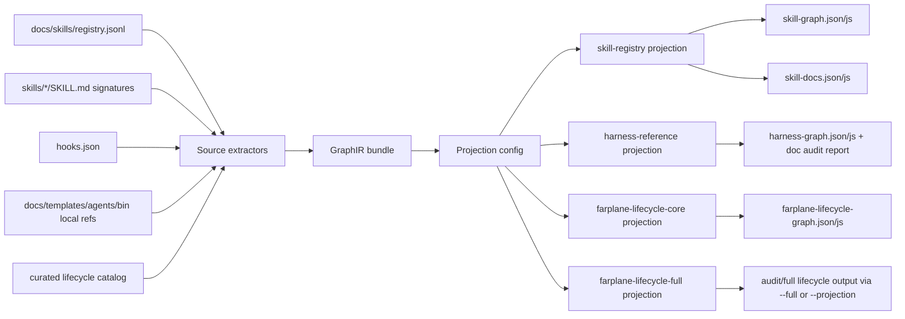

# TASK-0216 Introduce Shared GraphIR and Configurable Projections

## Summary

Unify Farplane's generated graph surfaces behind one shared graph intermediate
representation and named projection configs. Keep the current public artifacts
stable:

- `skill-graph.json` remains the skill registry projection.
- `harness-graph.json` remains the repo-reference projection.
- `farplane-lifecycle-graph.json` remains the semantic lifecycle projection.

The change is a generator/refactor layer, not a new runtime. Its purpose is to
let docs, skills, hooks, lifecycle files, tickets, and future UI views ask for
configured projections of one normalized graph model instead of maintaining
three unrelated graph dialects.

## Scope

- `In:`
  - Add shared graph model helpers for nodes, edges, evidence, counts,
    validation, sorting, JSON/JS emission, and generated timestamp handling.
  - Add projection configuration for named graph views:
    `skill-registry`, `harness-reference`, `farplane-lifecycle-core`, and
    `farplane-lifecycle-full`.
  - Port the existing skill, harness, and lifecycle generators to use the
    shared IR while preserving their current default output shapes and paths.
  - Keep lifecycle ticket flattening as the default projection behavior:
    `tickets/TASK-*/ticket.md`, `program.md`, `progress.md`, and `artifacts/`.
  - Document the projection contract and how future UI/harness consumers should
    choose or add projections.
  - Add focused tests for projection filtering, ticket flattening, edge
    validation, compatibility wrappers, and stale-output checks.
- `Out:`
  - Building or redesigning the Harness UI graph viewer.
  - Moving generated graph files out of `skills/skill-maintenance/graph/`.
  - Replacing canonical source files such as `docs/skills/registry.jsonl`,
    `SKILL.md`, `hooks.json`, or framework docs.
  - Adding a database, daemon, watcher, or hidden background graph service.
  - Inferring per-ticket IDs in the default lifecycle projection.

## Delta

- `Before:` the skill graph, harness-reference graph, and lifecycle graph each
  build their own node/edge shape, filtering rules, counts, and emitters.
- `After:` source extractors feed a shared `GraphIR`; named projection configs
  filter, flatten, validate, and emit the existing graph artifacts.
- `Why now:` the lifecycle graph clarified the core path, but its generator
  duplicated graph machinery and made it unclear whether lifecycle should be a
  separate graph or a projection of the skill graph.
- `Decision:` lifecycle should not be a projection of the current skill graph.
  Instead, skill, harness, and lifecycle graphs should all be projections of a
  broader GraphIR because lifecycle needs file, hook, automation, report, FSA,
  curated, and skill IO nodes that the skill registry graph does not own.

## Program

```text
signature:
  implement_graph_ir_projection_system(repo_root, existing_generators, graph_contract)
    -> shared_ir + projection_configs + compatible_outputs + docs + proof

vars:
  repo_root = /Users/kenjipcx/Zanarkand Technologies/projects/Farplane
  generated_dir = skills/skill-maintenance/graph
  source_surfaces =
    - docs/skills/registry.jsonl
    - skills/*/SKILL.md
    - hooks.json
    - docs/farplane-framework/graph-contract.md
    - skills/skill-maintenance/scripts/farplane_lifecycle_catalog.py
    - local docs/templates/agents/bin/tickets refs
  projections =
    - skill-registry
    - harness-reference
    - farplane-lifecycle-core
    - farplane-lifecycle-full

program:
  ground(existing_generators) -> current_schema_map
  define_graph_ir(current_schema_map) -> GraphNode + GraphEdge + GraphBundle
  define_projection_config(projections) -> include/exclude/flatten/sort rules
  extract_sources_to_ir(source_surfaces) -> normalized_graph_bundle
  port_lifecycle_generator(normalized_graph_bundle) -> compatible_lifecycle_output
  port_skill_generator(normalized_graph_bundle) -> compatible_skill_output
  port_harness_generator(normalized_graph_bundle) -> compatible_harness_output
  add_projection_cli(projections) -> inspectable named projection behavior
  update_docs(graph_contract) -> documented projection model
  verify(done_when, proof) -> evidence
```

## System Shape



Projection config should be explicit and small:

```text
ProjectionConfig = {
  name: string,
  node_kinds?: include/exclude sets,
  edge_types?: include/exclude sets,
  tags?: include/exclude sets,
  confidence?: include/exclude sets,
  flatteners?: [ticket_ids, timestamped_reports, method_routes],
  optional_nodes?: gates | abstract_state | fsa_states,
  output_schema: skill_graph | harness_graph | lifecycle_graph,
  emit: json/js/report/docs
}
```

The first implementation can keep the configs in Python so they are typed,
reviewable, and close to the generators:

- `skills/skill-maintenance/scripts/graph_ir.py`
- `skills/skill-maintenance/scripts/graph_projection.py`
- `skills/skill-maintenance/scripts/graph_projection_config.py`
- thin compatibility wrappers in the existing `generate_*_graph.py` scripts

Future UI work can add an external JSON config once there is a real non-Python
consumer. For this ticket, stable named profiles are enough and avoid inventing
a second config language before the model is proven.

## Map

- `Touch:`
  - `skills/skill-maintenance/scripts/generate_skill_graph.py`
  - `skills/skill-maintenance/scripts/generate_harness_graph.py`
  - `skills/skill-maintenance/scripts/generate_farplane_lifecycle_graph.py`
  - `skills/skill-maintenance/scripts/farplane_lifecycle_graph.py`
  - `skills/skill-maintenance/scripts/graph_ir.py`
  - `skills/skill-maintenance/scripts/graph_projection.py`
  - `skills/skill-maintenance/scripts/graph_projection_config.py`
  - `skills/skill-maintenance/scripts/test_generate_farplane_lifecycle_graph.py`
  - `skills/skill-maintenance/graph/README.md`
  - `docs/farplane-framework/graph-contract.md`
- `Inspect:`
  - `skills/skill-maintenance/scripts/farplane_lifecycle_catalog.py`
  - `skills/skill-maintenance/graph/skill-graph.json`
  - `skills/skill-maintenance/graph/harness-graph.json`
  - `skills/skill-maintenance/graph/farplane-lifecycle-graph.json`
  - `docs/skills/registry.jsonl`
  - `hooks.json`

## Done / Proof

```text
done_when:
  - The three existing generator commands still write the same artifact names.
  - Shared GraphIR owns node/edge normalization, validation, deterministic
    sorting, counts, and JSON/JS writing used by all three graph families.
  - Projection configs can produce skill-registry, harness-reference,
    farplane-lifecycle-core, and farplane-lifecycle-full outputs.
  - Default lifecycle output remains flattened and does not explode ticket IDs.
  - Full lifecycle output remains available for audit with gates, abstract
    state, and FSA state nodes.
  - Docs explain where generated data lives, which sources feed it, why the
    lifecycle graph is a projection sibling rather than a skill-graph child,
    and how to add or tune a projection.

proof:
  checks:
    - python3 -m py_compile skills/skill-maintenance/scripts/graph_ir.py skills/skill-maintenance/scripts/graph_projection.py skills/skill-maintenance/scripts/graph_projection_config.py skills/skill-maintenance/scripts/generate_skill_graph.py skills/skill-maintenance/scripts/generate_harness_graph.py skills/skill-maintenance/scripts/generate_farplane_lifecycle_graph.py skills/skill-maintenance/scripts/farplane_lifecycle_graph.py
    - PYTHONPATH=skills/skill-maintenance/scripts python3 -m pytest skills/skill-maintenance/scripts/test_generate_farplane_lifecycle_graph.py
    - python3 skills/skill-maintenance/scripts/generate_skill_graph.py
    - python3 skills/skill-maintenance/scripts/generate_harness_graph.py
    - python3 skills/skill-maintenance/scripts/generate_farplane_lifecycle_graph.py
    - python3 skills/skill-maintenance/scripts/generate_farplane_lifecycle_graph.py --check
    - python3 bin/validators/check_doc_refs.py
    - python3 tickets/scripts/check_ticket_metadata.py
    - git diff --check
  manual:
    - Compare generated node/edge counts before and after; explain intentional
      count changes in progress.md if the shared normalization changes them.
    - Confirm `rg "tickets/TASK-[0-9]{4}" skills/skill-maintenance/graph/farplane-lifecycle-graph.json`
      does not show per-ticket lifecycle nodes in the default output.
    - Confirm graph README names the shared IR and projection profiles.
  review:
    - rubric: code-quality, integration, docs
      required_tas: TAS-A
  evidence:
    - command outputs summarized in `progress.md`
    - reviewer report in `artifacts/review.md`
```

## State

- `next_action:` complete; commit GraphIR projection implementation.
- `blocked:` no.
- `latest_verification:` py_compile, lifecycle unittest, doc refs, ticket
  metadata, diff check, wrapper-vs-dispatcher comparison, and TAS-A review
  passed; harness-reference artifact freshness deferred due unrelated dirty
  worktree.
- `plan_qa:`
  - `minimal_required_version:` pass; refactor only the graph generators and
    docs, not UI/runtime.
  - `reuse_before_new_surface:` pass; preserve existing graph files and wrapper
    commands.
  - `least_parameters:` pass; start with named Python projection profiles,
    not a new user-facing config file format.
  - `new_files_functions_justified:` pass; shared IR/projection modules remove
    duplicated graph mechanics across three generators.
  - `goal_packet_preview:` pass; see `generated-goal-prompt.md`.
  - `clarifying_questions:` pass; no blocking question, because current
    artifacts and user preference define the path.
  - `proof_route_explicit:` pass.
  - `documentation_closeout_route:` pass.
  - `highest_risk:` over-normalizing and accidentally changing graph schemas
    used by the static viewer.
  - `fix_or_deferral:` keep compatibility wrappers and output schemas stable;
    document any intentional count/schema delta before review.

## Links

- `program:` [program.md](program.md)
- `progress:` [progress.md](progress.md)
- `goal_prompt:` [generated-goal-prompt.md](generated-goal-prompt.md)
- `refs:`
  - [docs/farplane-framework/graph-contract.md](../../docs/farplane-framework/graph-contract.md)
  - [skills/skill-maintenance/graph/README.md](../../skills/skill-maintenance/graph/README.md)
  - [skills/skill-maintenance/scripts/generate_skill_graph.py](../../skills/skill-maintenance/scripts/generate_skill_graph.py)
  - [skills/skill-maintenance/scripts/generate_harness_graph.py](../../skills/skill-maintenance/scripts/generate_harness_graph.py)
  - [skills/skill-maintenance/scripts/farplane_lifecycle_graph.py](../../skills/skill-maintenance/scripts/farplane_lifecycle_graph.py)

## Notes

- `Recommendation:` implement Option C, shared GraphIR with named projections.
- `Rejected option:` make lifecycle a projection of the current skill graph.
  That would lose hooks, files, reports, automation nodes, FSA projections, and
  curated lifecycle edges.
- `Deferred:` external JSON/YAML projection config and Harness UI rendering;
  both become safer once the Python projection profiles are stable.
