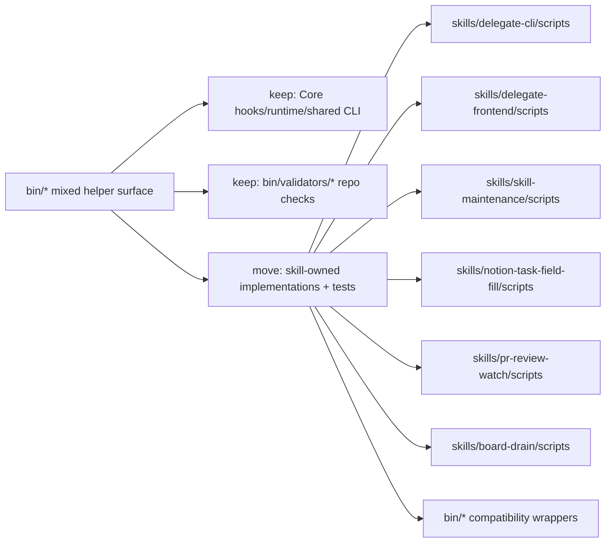

# TASK-0217 Clean up bin ownership and compatibility wrappers

## Summary

Top-level `bin/` has accumulated runtime shims, skill-owned helpers, validators,
tests, and stale utilities. Move skill-owned implementations and tests into
their owning packages, keep compatibility wrappers for established command
paths, and leave only Core runtime/shared command surfaces in top-level `bin/`.

## Scope

- `In:` skill-owned helper migration, adjacent owner-local tests, compatibility
  wrappers, reference updates, stale/generated cleanup, focused checks.
- `Out:` changing hook behavior, changing Farplane-UI hook ownership, broad
  Python packaging, rewriting archived tickets, moving live Core shims.

## Delta

- `Before:` `bin/` mixes live hooks, validators, tests, skill workflow helpers,
  generated bytecode, and low-reference utilities.
- `After:` skill workflow helpers live under `skills/<owner>/scripts/`; tests
  live beside the owning implementation; old public `bin/*` commands remain as
  wrappers where references or install habits still exist.
- `Why now:` operator explicitly found `bin/` hard to reason about and asked for
  a right-directory strategy plus relevance review.
- `First-principles basis:` `bin/` should be the installed Core command edge,
  not a junk drawer. Source ownership should follow the module that changes
  behavior, while wrappers preserve old command compatibility and reduce
  migration risk.

## Map



- `Touch:` `bin/*` wrappers, owner skill `scripts/`, owner skill docs,
  feature/doc-audit refs, this ticket.
- `Inspect:` `install.sh`, `hooks.json`, `bin/README.md`, feature registry,
  skill docs, focused tests.
- `Legend:` keep | move | add wrapper | remove generated/stale.

## Program

```text
signature:
  bin_cleanup(bin_inventory, owner_rules) -> moved_scripts + wrappers + proof

vars:
  target = top-level bin ownership cleanup
  owner = skill package when helper implements one skill workflow

program:
  ground(bin refs, install allowlist, skill docs) -> classification
  move(skill_owned_helpers) -> skills/<owner>/scripts + owner-local tests
  wrap(old_bin_commands) -> compatibility commands
  remove(stale_generated_or_unreferenced) -> less noise
  verify(old_commands, new_tests, doc refs, py_compile) -> evidence
```

## Done / Proof

```text
done_when:
  - skill-owned helper implementations and tests are owner-local
  - top-level bin command paths still work for migrated public commands
  - generated bytecode under migrated surfaces is removed
  - stale/unreferenced utility decision is documented

proof:
  checks:
    - python3 -m unittest focused migrated tests
    - python3 bin/validators/check_doc_refs.py
    - python3 -m py_compile migrated wrappers and scripts
    - wrapper smoke commands for public commands with --help or fixture JSON
  manual:
    - confirm Core hook install remains Core-owned and already linked
  review:
    - rubric: none mechanical
      required_tas: none
  evidence:
    - final response command summary
```

## Documentation / Closeout

```text
docs_closeout:
  close_ticket: required
  documentation_skill: not_required
  docs_changed:
    - bin/README.md
    - docs/doc-audit/2026-06-12-bin-audit.md
    - docs/features/registry.jsonl
  documentation_reason: routine ownership docs and registry refs
  final_writeback:
    - ticket latest_verification
    - docs updated with moved owner paths
```

## State

- `next_action:` done; archive after operator review if desired.
- `blocked:` none.
- `latest_verification:` `python3 -m unittest` over migrated helper tests
  passed 88 tests; `python3 bin/validators/check_harness_invariants.py`,
  `python3 bin/validators/check_doc_parity.py`,
  `python3 bin/validators/check_doc_refs.py`,
  `python3 tickets/scripts/check_ticket_metadata.py`, `python3 -m py_compile`
  for migrated wrappers/scripts, wrapper smoke commands, and
  `python3 bin/farplane.py hooks doctor --json` passed.
- `plan_qa:` minimal required version pass; reuse before new surface pass;
  least parameters pass; new files/functions justified by ownership pass; goal
  packet preview not applicable; proof route explicit pass; documentation
  closeout route pass.

## Links

- `refs:` `docs/doc-audit/2026-06-12-bin-audit.md`, `bin/README.md`,
  `AGENTS.md`, `install.sh`

## Notes

- `Blast radius:` local repo layout, docs, and compatibility command wrappers.
- `Risks / rollback:` wrapper failure; rollback by restoring implementation to
  `bin/` or fixing wrapper import path.
- `Follow-ups:` consider a later real Python package split only after owner
  boundaries stabilize.
