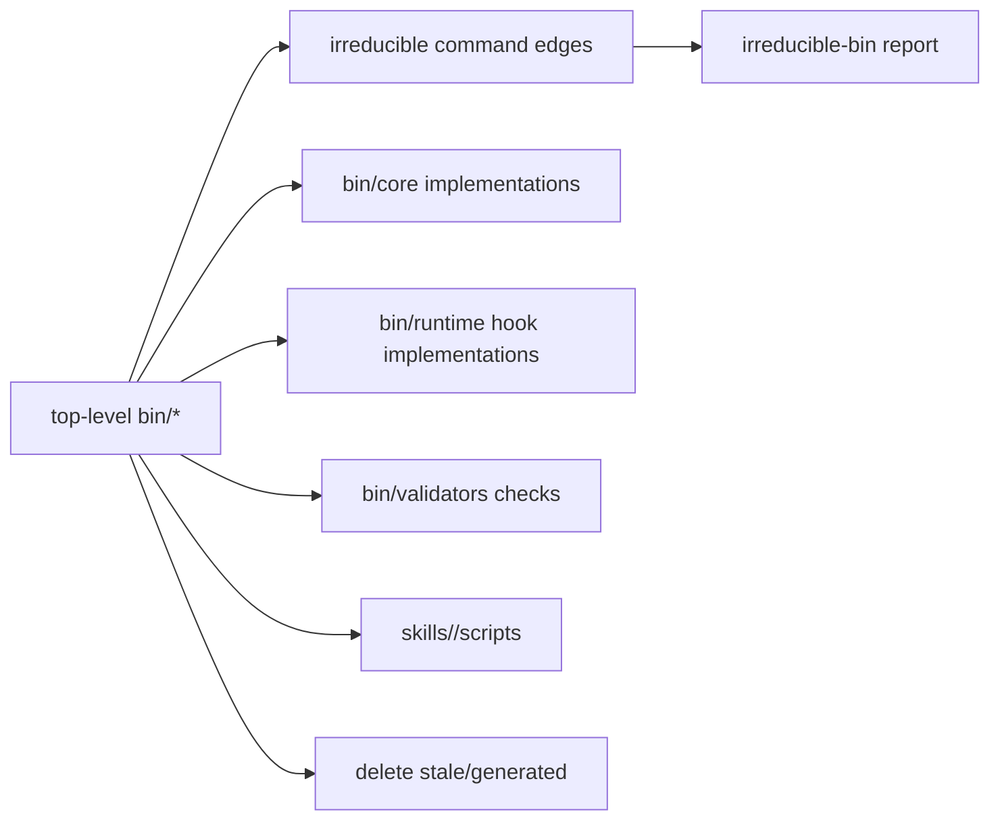

# TASK-0218: Minimize top-level bin surface

## Summary

Continue the bin cleanup from `TASK-0217` by reducing the number of files that
live directly under top-level `bin/`. Keep public command compatibility and
install behavior working, but move, consolidate, or delete every remaining
top-level bin file that does not truly need to be a command edge.

## Scope

- In:
  - inventory every current top-level `bin/*` file and classify it as public
    command, compatibility wrapper, validator wrapper, stale wrapper,
    install-owned shim, or move/delete candidate
  - shrink top-level `bin/` by moving implementations to clearer owners such as
    `bin/core/`, `bin/runtime/`, `bin/validators/`, or `skills/<owner>/scripts/`
  - update install allowlists, docs, references, wrappers, tests, and validators
    after each move
  - delete stale or generated files when reference and usage checks show they
    are no longer needed
  - produce an irreducible-bin report listing each remaining top-level file and
    why it must stay
- Out:
  - removing public command compatibility without a wrapper or documented
    migration reason
  - changing hook behavior beyond import/path compatibility
  - broad Python packaging or repo-wide build-system rewrites
  - editing unrelated automation, archived ticket cleanup, or skill registry
    work already dirty in the workspace

## Delta

- `Before:` top-level `bin/` still has dozens of files, including wrappers,
  validator wrappers, live commands, and unclear legacy command edges.
- `After:` top-level `bin/` contains 17 files: bin-local docs, shared wrapper
  loader, live installed hook/runtime shims, global CLI edges, and public Core
  command aliases that still need compatibility. Implementation code, tests,
  validators, and package-specific helpers live under owned directories.
- `Why now:` the operator explicitly wants the bin surface minimized until it
  cannot be reduced safely anymore.
- `First-principles basis:`
  - `objective:` make `bin/` scannable as a small installed command surface.
  - `need:` future agents should not treat `bin/` as a default dumping ground.
  - `assumptions:` compatibility wrappers are acceptable when old paths are
    referenced or installed; deleting stale files is acceptable when no active
    references or install paths remain.
  - `root_cause:` `bin/` historically mixed command edges, implementations,
    validators, tests, and skill-local helpers.
  - `constraints:` preserve live hook/install command paths and do not stage
    unrelated dirty workspace changes.
  - `first_viable_slice:` classify the top-level inventory, then move one safe
    cluster at a time with tests.
  - `proof_or_falsification:` success is a lower top-level file count plus
    passing tests, doc refs, harness invariants, install syntax, and command
    wrapper smokes; falsified by broken install, broken hook import, or stale
    docs.
  - `tradeoff:` keep some wrappers when compatibility is more valuable than a
    perfectly empty top-level directory.
  - `non_goals:` aesthetic deletion, hidden runtime changes, and unrelated
    archive/automation cleanup.

## Program

```text
signature:
  minimize_bin_surface(bin_inventory, refs, install_contract)
    -> moved_or_deleted_files + wrappers + irreducible_report + evidence

vars:
  target = smallest practical top-level bin command surface
  owner = bin core/runtime/validators or skill package

program:
  inventory(bin top-level, install.sh, docs, configs, refs)
    -> classified_file_table

  reduce(classified_file_table)
    -> moves/deletions/wrappers in safe clusters

  verify(cluster)
    -> tests + doc refs + harness invariants + wrapper smokes

  document(final_state)
    -> bin README/rules + irreducible-bin report
```

## Map

- `Touch:` `bin/*`, `bin/core/`, `bin/runtime/`, `bin/validators/`,
  `skills/<owner>/scripts/` when owner-specific files remain, `install.sh`,
  `bin/README.md`, `bin/AGENTS.md`, `PROJECT_RULES.md`, `AGENTS.md`,
  `docs/doc-audit/2026-06-12-bin-audit.md`,
  `tickets/TASK-0218/artifacts/proof/irreducible-bin.md`
- `Inspect:` `README.md`, `ARCHITECTURE.md`, `config.toml.example`,
  `templates/global/*`, `hooks.json`, `install.sh`, `bin/README.md`, active
  docs and registries that reference `bin/*`
- `Signature delta:` expected to be path/import-only; any behavioral function
  change must be called out explicitly in `progress.md`
- `Diagram:`



## Done / Proof

```text
done_when:
  - every top-level bin file has a documented keep/move/delete decision
  - top-level bin file count is reduced as far as compatibility and install
    constraints allow
  - old public commands either still work through wrappers or have a documented
    removal reason
  - implementation/tests/validators are not left in top-level bin unless the
    irreducible report justifies them
  - generated caches under bin are removed

proof:
  checks:
    - python3 -m unittest discover -s bin/tests -p 'test_*.py'
    - python3 -m unittest discover -s bin/validators -p 'test_*.py'
    - python3 bin/validators/check_doc_refs.py
    - python3 bin/validators/check_harness_invariants.py
    - python3 tickets/scripts/check_ticket_metadata.py
    - python3 -m py_compile selected wrappers and moved implementations
    - bash -n install.sh
  manual:
    - wrapper smoke commands for remaining public command edges
    - compare pre/post top-level bin file count
    - inspect irreducible-bin report for each remaining file
  review:
    - rubric: none mechanical
      required_tas: none
  evidence:
    - tickets/TASK-0218/artifacts/proof/irreducible-bin.md
    - final response check summary and commit hash if committed
```

## Run Hints

- `Likely size:` large
- `Goal recommendation:` required
- `Budget hint:` time not specified; token/model/compute none; subagent none
  unless a review lane becomes useful; review/QA none mechanical; spend none
- `Compute hint:` local_shared
- `Planning hint:` light
- `Proof weight:` tests
- `Proof route:` none mechanical
- `Final evidence:` file-count delta, irreducible-bin report, check summary,
  and commit hash if committed
- `Batchability:` single-ticket
- `Human inputs/assets:` none
- `Credentials / external access:` none
- `Compute/runtime needs:` local shell only
- `Tooling gaps:` none known
- `QA risks:` accidental removal of installed compatibility command or hook
  path; stale docs after moves
- `Human gates:` none; operator explicitly asked to set the Goal and minimize
- `Agent decision boundaries:` may move/delete local files after reference
  checks; must not remove live installed hook/CLI compatibility silently

## Goal Packet

- `Goal packet:` active
- `Program:` `tickets/TASK-0218/program.md`
- `Progress:` `tickets/TASK-0218/progress.md`
- `Files:`
  - `tickets/TASK-0218/ticket.md`
  - `tickets/TASK-0218/program.md`
  - `tickets/TASK-0218/progress.md`
  - `bin/README.md`
  - `bin/AGENTS.md`
  - `PROJECT_RULES.md`
  - `AGENTS.md`
  - `install.sh`
- `Generated Goal prompt:`

```text
/goal Run the following files as one Goal Packet.
Files:
- tickets/TASK-0218/ticket.md
- tickets/TASK-0218/program.md
- tickets/TASK-0218/progress.md
- bin/README.md
- bin/AGENTS.md
- PROJECT_RULES.md
- AGENTS.md
- install.sh

Task: Minimize top-level `bin/` as much as possible while preserving live hook,
install, validator, and public command compatibility. Treat the listed files as
the source of truth. Do not stage unrelated dirty workspace changes. Produce an
irreducible-bin report that justifies every remaining top-level `bin/*` file.

Logging: Before ending each turn, append a compact structured entry to
`tickets/TASK-0218/progress.md` with actions, files changed, evidence, drift
verdict, next action, and blockers.

Metric: Mechanical pass/fail from `tickets/TASK-0218/program.md`: lower
top-level bin file count, every remaining file justified, wrapper/install paths
working, generated caches removed, and required tests/checks passing.

After each turn: Compare progress against the listed ticket/program/progress
files, continue within the current window while safe reductions remain, and
stop complete only when no further safe bin reductions remain and proof passes.
Stop blocked with attempted paths and the exact compatibility constraint when a
file cannot be moved or deleted.

Approval: approved by operator request on 2026-06-24.
```

- `Metric provider:` mechanical
- `Feedback preset:` none
- `Drift reviewer:` inline
- `Heartbeat:` none
- `Stop condition:` complete when all safe reductions are exhausted, proof
  passes, and the irreducible-bin report exists; blocked when the next reduction
  would require removing compatibility, changing architecture, or touching
  unrelated dirty work without evidence
- `Final report:` include before/after top-level bin count, moved/deleted/kept
  summary, proof checks, and commit hash if committed
- `Reflection:` use `progress.md`
- `Refs:` `docs/specs/goal-loop-contract.md`,
  `tickets/templates/goal-loop/program.md`,
  `tickets/templates/goal-loop/progress.md`

## State

- `next_action:` start Goal-backed bin minimization pass.
- `blocked:` none.
- `latest_verification:` `python3 -m unittest discover -s bin/tests -p
  'test_*.py'` passed 136 tests; `python3 -m unittest discover -s
  bin/validators -p 'test_*.py'` passed 36 tests;
  `python3 bin/validators/check_doc_refs.py`, `python3
  bin/validators/check_harness_invariants.py`, `python3
  tickets/scripts/check_ticket_metadata.py`, `python3 -m py_compile ...`,
  `bash -n install.sh`, and wrapper/owner-script `--help` smoke commands
  passed.
- `result:` top-level `bin/` reduced from 36 files to 17 files; report written
  at `tickets/TASK-0218/artifacts/proof/irreducible-bin.md`.

## Links

- `program:` `tickets/TASK-0218/program.md`
- `progress:` `tickets/TASK-0218/progress.md`
- `artifacts:` `tickets/TASK-0218/artifacts/proof/`
- `review:` none mechanical
- `refs:` `docs/specs/goal-loop-contract.md`,
  `tickets/templates/goal-loop/program.md`,
  `tickets/templates/goal-loop/progress.md`
