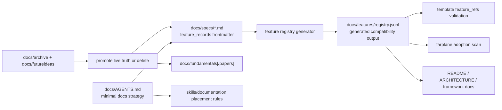

# TASK-0231: Generate feature registry from spec metadata and prune stale docs

## Summary

Revamp Farplane docs so specs own feature truth and the feature registry becomes
a generated compatibility artifact instead of a hand-authored second source of
truth. The decisive path is to add a docs strategy `AGENTS.md`, define
spec-frontmatter feature records, build a generator/validator that emits
`docs/features/registry.jsonl`, migrate current feature rows into canonical spec
metadata, update consumers, and delete stale archive/future-idea docs after
lifting any live truth.

## Scope

- In:
  - Add a docs-tree `docs/AGENTS.md` with the doc strategy: minimal docs,
    maximum quality, update existing owners before creating new docs, and
    generated inventories instead of duplicate hand-authored registries.
  - Update `docs/specs/AGENTS.md`, `docs/specs/doc-governance.md`,
    `docs/specs/filesystem-lifecycle.md`, `docs/farplane-framework/*`, and
    `skills/documentation/SKILL.md` so placement rules prefer spec-owned
    feature metadata and public framework docs stay curated.
  - Define a spec metadata schema that supports one or more `feature_records`
    per spec file while preserving stable `FEAT-####` IDs.
  - Replace the hand-authored feature registry workflow with a generator and
    validator that derives `docs/features/registry.jsonl` from spec/frontmatter
    metadata.
  - Migrate current `docs/features/registry.jsonl` rows into canonical specs or
    compact spec-owned feature records, preserving template-critical IDs such as
    skill evals, QA checklist, skill template intelligence, template-owned skill
    feature metadata, front matter, local reference checks, and related high
    profile features.
  - Update registry consumers and tests: feature validation, template registry
    feature-ref checks, adoption scan, docs references, harness-maintenance
    docs, README/ARCHITECTURE references, and generated graph/doc audit paths.
  - Delete `docs/archive/**` and `docs/futureideas/**` after auditing references
    and moving any still-current truth into specs, fundamentals, tickets, or
    active docs.
  - Preserve `docs/fundamentals/` as theory/background, and create or reserve a
    `docs/fundamentals/papers/` owner only if paper-grade research content has a
    current reader and lifecycle.
  - Run the relevant validators and update generated artifacts after migration.
- Out:
  - No compatibility promise for the old hand-authored feature registry source
    shape.
  - No retention of archive/futureideas as tracked permanent docs just because
    they existed before.
  - No broad rewrite of unrelated product docs, tickets, skills, or code style.
  - No deletion of ticket archives, source registry IDs, generated skill
    registries, or proof artifacts.
  - No public docs polish beyond what is needed to keep the new architecture
    coherent.

## Delta

- `Before:` `docs/specs/*` owns behavior contracts, `docs/features/registry.jsonl`
  separately owns feature rows, `docs/features/README.md` teaches hand edits,
  and stale `docs/archive/**` / `docs/futureideas/**` remain tracked cold docs.
- `After:` specs own feature records in metadata, `docs/features/registry.jsonl`
  is generated for compatibility/query consumers, docs instructions autoload the
  minimal-docs strategy, interval docs consolidation routes stale feature rows
  back to specs, and tracked archive/futureideas docs are gone unless promoted
  into active owners.
- `Why now:` Feature rows have not been maintained diligently, and the current
  split invites agents to update JSONL by hand instead of improving the durable
  spec that explains the capability.
- `First-principles basis:`
  - `objective:` reduce docs surface area while improving correctness,
    discoverability, and generated machine inventory quality.
  - `need:` Farplane needs stable `FEAT-*` handles for templates/adoption, but
    humans and agents need one authored place to update feature meaning.
  - `assumptions:` there are no public users yet, so a breaking cleanup is
    acceptable if validators and compatibility output preserve internal
    consumers.
  - `root_cause:` feature truth is duplicated across specs, harness-techniques,
    README/ARCHITECTURE, and a hand-authored JSONL registry.
  - `constraints:` preserve stable IDs, do not lose template-critical feature
    refs, keep generated outputs checkable, and do not silently delete current
    truth while pruning archive/futureideas.
  - `first_viable_slice:` define metadata schema, implement generator, migrate
    all current feature rows, update docs/consumers, delete stale archive docs,
    and prove with validators.
  - `proof_or_falsification:` proof fails if any template feature ref breaks,
    generated registry drifts from source specs, docs still instruct hand edits,
    or deleted archive/futureideas refs remain.
  - `tradeoff:` a full migration has broader blast radius, but avoids months of
    compatibility cruft around a known bad source-of-truth split.
  - `non_goals:` no app UI work, no hidden doc daemon, no source registry
    redesign, no ticket archive deletion, no broad historical preservation.

## Program

```text
signature:
  migrate_feature_docs(current_specs, feature_registry, docs_policy, consumers)
    -> spec_metadata_source + generated_registry + pruned_docs + validation_evidence

vars:
  target = docs/specs as authored feature source; docs/features/registry.jsonl as generated output
  owner = doc-governance + documentation skill + feature generator/validator
  generated_output = docs/features/registry.jsonl
  delete_targets = [docs/archive, docs/futureideas]

program:
  ground(vars)
    -> inventory feature rows, template feature_refs, registry consumers, docs references,
       archive/futureideas references, and existing spec frontmatter

  design_schema(current_state)
    -> feature_records frontmatter schema
    -> generator/validator contract
    -> docs placement rules

  implement_schema_and_generator(schema)
    -> parser over active specs
    -> generated docs/features/registry.jsonl
    -> validation for stable IDs, refs, status enums, evidence, template refs,
       duplicate IDs, and generated-output freshness

  migrate_rows(feature_registry)
    -> feature_records in canonical specs
    -> updated docs/specs/README.md and harness-techniques strategy
    -> preserved high-profile FEAT IDs used by templates and skills

  prune_docs(delete_targets)
    -> promote any live truth from docs/archive or docs/futureideas
    -> delete stale tracked archive/futureideas files
    -> update broken refs

  update_consumers(generated_output)
    -> README/ARCHITECTURE/docs/farplane-framework/docs/features/docs/templates/bin refs
    -> documentation and interval-update routing rules
    -> tests/validators adjusted for generated source

  verify(done_when, proof)
    -> validators, generated freshness check, stale-ref search, ticket evidence,
       reviewer TAS gate
```

## Map

- `Touch:`
  - `docs/AGENTS.md`
  - `docs/specs/AGENTS.md`
  - `docs/specs/doc-governance.md`
  - `docs/specs/filesystem-lifecycle.md`
  - `docs/specs/README.md`
  - `docs/specs/harness-techniques.md`
  - `docs/farplane-framework/README.md`
  - `docs/farplane-framework/harness-maintenance.md`
  - `docs/features/README.md`
  - `docs/features/registry.jsonl`
  - `docs/features/validate_features.py`
  - `skills/documentation/SKILL.md`
  - `skills/interval-update/references/workflows/docs-consolidation.md`
  - `bin/core/farplane_adoption.py`
  - `bin/validators/sync_template_registry.py`
  - `README.md`
  - `ARCHITECTURE.md`
  - generated graph/doc audit artifacts as required by validators
- `Inspect:`
  - `docs/features/AGENTS.md`
  - `docs/features/registry.jsonl`
  - `docs/templates/registry.jsonl`
  - `docs/skills/templates/*`
  - `docs/archive/**`
  - `docs/futureideas/**`
  - `bin/tests/test_farplane_adoption.py`
  - `bin/validators/test_sync_template_registry.py`
  - `bin/validators/check_doc_refs.py`
- `Signature delta:`
  - `docs/features/validate_features.py / build_feature_registry(root): list[FeatureRecord]`
  - `docs/features/validate_features.py / validate_generated_registry(root): errors[]`
  - `bin/validators/sync_template_registry.py / load_feature_ids(root): set[str]`
  - `bin/core/farplane_adoption.py / load_feature_registry(path): dict[str, FeatureRecord]`
- `Type Sketch:`
  - `FeatureRecord { id, name, status, category, surfaces, source_refs, external_refs, evidence_refs, known_limits, metrics, last_verified }`
  - `SpecFeatureMetadata { feature_records: FeatureRecord[] }`
  - `GeneratedRegistry { source_specs, rows, checksum_or_freshness_marker? }`
- `Typed flow example:`
  - `docs/specs/inspiration-vault.md frontmatter feature_records[FEAT-0056]`
    -> generator row
    -> `docs/features/registry.jsonl`
    -> template/adoption/doc validators read stable `FEAT-0056`.
- `Diagram:`



## Gap Analysis

- `Current state:` Feature rows are hand-authored in
  `docs/features/registry.jsonl`, validated by `docs/features/validate_features.py`,
  referenced by template registry/adoption tooling, and described in
  `docs/features/README.md`, `docs/farplane-framework/harness-maintenance.md`,
  README, ARCHITECTURE, and specs.
- `Production expectation:` Authored truth should live with the human-readable
  behavior contract. Machine inventories should be generated and validated from
  source artifacts, like the skill registry generated from skill frontmatter.
- `Missing gaps:` no feature metadata schema on specs, no generator, no
  freshness check, no docs-level autoload strategy, no archive/futureideas prune
  policy aligned with the new minimal-docs strategy.
- `Comparable implementations:` local Farplane generated skill registry and
  template registry patterns inspected; no external grounding needed because
  this is repo-internal architecture.
- `Recommendation:` do the full migration now, preserve generated compatibility
  output during internal transition, and delete stale archive/futureideas after
  reference audit.

## Done / Proof

```text
done_when:
  - docs/specs or canonical active specs own every stable feature record that
    remains relevant.
  - docs/features/registry.jsonl is generated from spec metadata and no active
    docs instruct agents to hand-edit feature rows.
  - template-critical feature IDs in skill/template metadata still validate.
  - docs/archive/** and docs/futureideas/** are removed or reduced to no tracked
    files after live truth has been promoted.
  - docs/AGENTS.md and skills/documentation/SKILL.md teach the new placement
    and minimal-docs strategy.

proof:
  checks:
    - python3 docs/features/validate_features.py
    - python3 bin/validators/sync_template_registry.py --check
    - python3 bin/validators/check_doc_refs.py
    - python3 bin/validators/check_doc_parity.py
    - python3 tickets/scripts/check_ticket_metadata.py
    - targeted tests for feature generation and registry consumers
  manual:
    - rg confirms no active docs tell agents to hand-edit docs/features/registry.jsonl.
    - rg confirms no active refs to deleted docs/archive/** or docs/futureideas/** remain.
    - Review generated registry diff against prior registry for preserved IDs,
      retired/deleted decisions, and template feature_refs.
  review:
    - rubric: docs + implementation + harness-maintenance
      required_tas: TAS-A or explicit revise items resolved
  evidence:
    - ticket progress entry with changed source specs and generated registry summary
    - command outputs or artifact files under tickets/TASK-0231/artifacts/
    - reviewer receipt under tickets/TASK-0231/artifacts/review/
    - final summary with Before/After/Example deltas and Grounding line
```

Grounding evidence: local-only, because the migration concerns Farplane's own
docs architecture and generated-registry patterns. Implementation should inspect
local generator patterns such as `bin/validators/sync_skill_registry.py`,
`bin/validators/sync_template_registry.py`, and current consumers before final
code changes.

Completion evidence:

- [x] `docs/AGENTS.md` added with minimal-docs strategy and generated feature
  registry rules.
- [x] `docs/specs/feature-catalog.md` added as transitional spec-owned feature
  metadata source with 63 committed `FEAT-*` records.
- [x] `docs/features/validate_features.py --write` now generates and validates
  `docs/features/registry.jsonl` from spec `feature_records_json`.
- [x] `docs/archive/**` and `docs/futureideas/**` tracked files deleted; live
  references redirected or intentionally skipped by active validators.
- [x] Feature/source/doc/template/harness validators passed on 2026-06-26:
  `docs/features/validate_features.py`, `docs/sources/validate_sources.py`,
  `check_doc_refs.py`, `check_doc_parity.py`,
  `check_harness_invariants.py`, `check_ticket_metadata.py`, and
  `sync_template_registry.py --check`.
- [x] Targeted tests passed:
  `bin.validators.test_sync_template_registry` and script-local
  `test_generate_template_intelligence`, `test_generate_farplane_lifecycle_graph`,
  `test_generate_skill_graph`.
- [x] Review artifact:
  `tickets/TASK-0231/artifacts/review.md`.

## Run Hints

- `Likely size:` large
- `Goal recommendation:` required
- `Budget hint:` one strong native Goal window, local shared checkout, reviewer
  lane required before completion
- `Compute hint:` local_shared
- `Planning hint:` impl_plan
- `Proof weight:` tests + review
- `Proof route:` reviewer
- `Final evidence:` validator/test outputs plus reviewer receipt
- `Batchability:` single-ticket
- `Batch reason:` one source-of-truth migration with tightly coupled docs,
  generator, consumers, and deletion proof
- `Human inputs/assets:` none after plan approval
- `Credentials / external access:` none
- `Compute/runtime needs:` Python test/validator environment only
- `Tooling gaps:` generator may need new parser support for multi-record YAML
  frontmatter
- `QA risks:` stale refs, lost feature IDs, accidental hand-authored generated
  output, over-deleting historical truth
- `Human gates:` approve plan and Goal Packet before deletion/build
- `Agent decision boundaries:` may delete archive/futureideas after audit;
  must not delete ticket archives, source registry IDs, proof artifacts, or
  unrelated history ledgers

## Goal Packet

- `Goal packet:` required
- `Program:` `tickets/TASK-0231/program.md`
- `Progress:` `tickets/TASK-0231/progress.md`
- `Files:`
  - `tickets/TASK-0231/ticket.md`
  - `tickets/TASK-0231/program.md`
  - `tickets/TASK-0231/progress.md`
  - `docs/features/README.md`
  - `docs/features/registry.jsonl`
  - `docs/features/validate_features.py`
  - `docs/specs/doc-governance.md`
  - `docs/specs/filesystem-lifecycle.md`
  - `docs/farplane-framework/harness-maintenance.md`
  - `skills/documentation/SKILL.md`
  - `skills/interval-update/references/workflows/docs-consolidation.md`
  - `bin/core/farplane_adoption.py`
  - `bin/validators/sync_template_registry.py`
- `Generated Goal prompt:`

```text
/goal Run the following files as one Goal Packet.
Files:
- tickets/TASK-0231/ticket.md
- tickets/TASK-0231/program.md
- tickets/TASK-0231/progress.md
- docs/features/README.md
- docs/features/registry.jsonl
- docs/features/validate_features.py
- docs/specs/doc-governance.md
- docs/specs/filesystem-lifecycle.md
- docs/farplane-framework/harness-maintenance.md
- skills/documentation/SKILL.md
- skills/interval-update/references/workflows/docs-consolidation.md
- bin/core/farplane_adoption.py
- bin/validators/sync_template_registry.py

Task: Complete the desired outcomes defined across the listed files. Preserve
TASK-0231 scope, constraints, Done / Proof, budget, deletion boundaries, and
stop conditions. Treat the listed files plus current repo search results as the
source of truth; do not rely on transcript memory.

Logging: Before ending each turn, append a compact structured entry to
tickets/TASK-0231/progress.md with files changed, evidence, drift verdict,
next action, and blockers.

Metric: Satisfy the Done / Proof in tickets/TASK-0231/ticket.md and the
mechanical/review proof policy in tickets/TASK-0231/program.md. Preserve stable
FEAT-* IDs needed by templates, adoption, and docs. Do not count
self-certification as final review.

After each turn: Compare progress against the ticket/program/progress files,
continue within the current time/budget window if useful, otherwise stop
complete, stop blocked, or request reviewer evidence. For completion, include
validator/test outputs, stale-ref search results, deletion audit summary, and
review receipt. Grounding: local generator and registry patterns checked.

Approval: This prompt may be run only after the human has approved the current
Goal Packet. If the ticket plan changes after this packet was compiled, return
to goal-advisor, regenerate the packet, and ask for approval again.
```

- `Metric provider:` hybrid
- `Feedback preset:` none
- `Drift reviewer:` reviewer
- `Heartbeat:` none
- `Stop condition:` complete when all Done / Proof checks pass and reviewer
  accepts; blocked on unresolved feature-ID loss, stale refs that cannot be
  resolved, or deletion scope conflict
- `Final report:` include validator output summary, generated registry summary,
  deleted archive/futureideas audit, and review receipt.
- `Reflection:` use `progress.md`; create `decisions.md` only if migration
  uncovers a material schema fork.
- `Refs:` `docs/specs/goal-loop-contract.md`,
  `tickets/templates/goal-loop/program.md`,
  `tickets/templates/goal-loop/progress.md`

## State

- `next_action:` implement approved Goal Packet and append progress evidence
  before completion
- `blocked:` false
- `latest_verification:` plan approved by operator; implementation started
- `result:` building
- `plan_qa:`
  - `minimal_required_version:` pass
  - `reuse_before_new_surface:` pass; reuse generated registry patterns from
    skill/template registries before adding new machinery
  - `least_parameters:` pass
  - `new_files_functions_justified:` pass; docs autoload and generator are
    required by the requested ownership change
  - `minimal_impl_plan_claim:` pass; full migration is accepted because no
    public users exist and partial compatibility would preserve the mess
  - `existing_service_fit:` pass; extend registry/validator/adoption consumers
    rather than adding a separate feature service
  - `goal_packet_preview:` pass
  - `clarifying_questions:` pass; user explicitly approved full migration and
    archive/futureideas deletion direction
  - `proof_route_explicit:` pass
  - `documentation_closeout_route:` pass
  - `grounding_evidence:` local_only
  - `highest_risk:` losing or invalidating stable feature IDs used by templates
  - `fix_or_deferral:` preserve all referenced FEAT IDs unless the build proves
    a row is unreferenced and obsolete, and document retire/delete decisions in
    progress/evidence

## Links

- `program:` `tickets/TASK-0231/program.md`
- `progress:` `tickets/TASK-0231/progress.md`
- `artifacts:` `tickets/TASK-0231/artifacts/`
- `review:` `tickets/TASK-0231/artifacts/review/`
- `refs:`
  - `docs/features/README.md`
  - `docs/features/validate_features.py`
  - `docs/specs/doc-governance.md`
  - `docs/specs/filesystem-lifecycle.md`
  - `docs/farplane-framework/harness-maintenance.md`
  - `skills/documentation/SKILL.md`
  - `skills/interval-update/references/workflows/docs-consolidation.md`

## Notes

- `Blast radius:` docs architecture, feature registry generation, template
  feature validation, adoption scan, public framework docs, stale archive refs.
- `Risks / rollback:` if full migration destabilizes too many consumers, keep
  `docs/features/registry.jsonl` as generated compatibility output while
  deferring removal of `docs/features/README.md`; do not restore hand-authored
  JSONL as source truth.
- `Follow-ups:` Farplane UI can later read generated feature payloads directly;
  `docs/fundamentals/papers/` should be created only with a real paper/research
  lifecycle owner.
