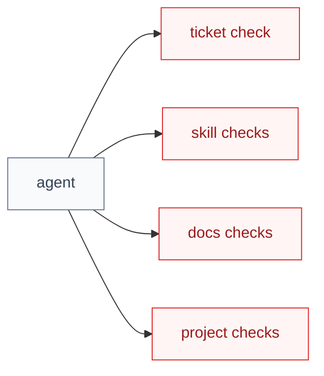
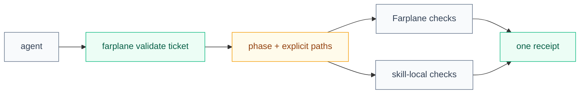

# TASK-0323 Visual Plan

## Before: agents orchestrate validators manually

Legend: red is fragmented manual invocation; gray is retained agency.

## After: one ticket API selects modular checks

Legend: green is new API/evidence; amber is changed selection; gray stays modular.
