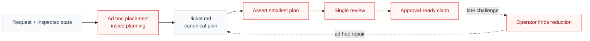
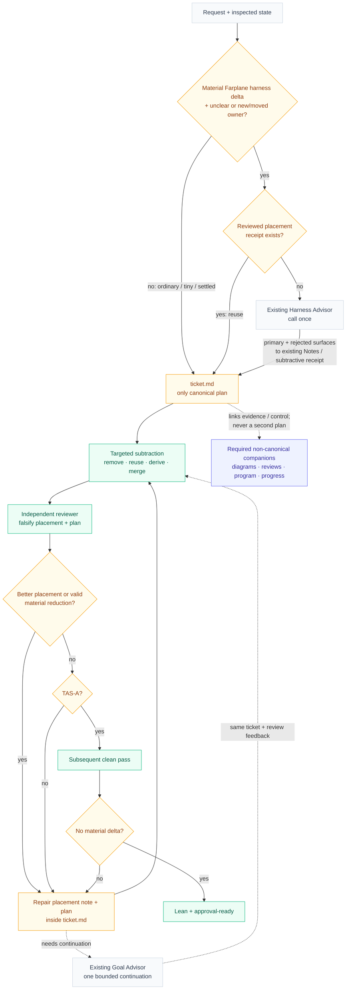

# Visual Plan

## Diagram Intent

Show how material coding plans resolve only genuinely ambiguous Farplane
harness placement, then move from asserted minimality to evidenced lean
convergence while `ticket.md` remains the one canonical plan.

## Reading Order

- Start with `Before` for the claim-based path and its missing convergence gate.
- Read `After` as the execution/review loop and companion ownership map.
- Use `Feedback Guide` to return any scope correction to `ticket.md`.

## Before: Placement and minimality can both escape falsification

A material harness plan can repeat placement reasoning inside planning, justify
additions locally, and pass one review. Better ownership or valid reductions
discovered later depend on operator challenge or ad hoc repair.

Legend:
- gray = existing canonical context that stays
- red = claim-based or unconverged behavior being replaced
- dashed edge = non-standard late feedback path

## After: Narrow placement reuse feeds one convergent ticket

Only the unresolved material Farplane harness case calls existing Harness
Advisor once before drafting. The independent reviewer then tries to falsify
both placement and plan; acceptance still requires TAS-A plus a clean pass.

Legend:
- gray = existing owner or route reused unchanged
- amber = changed gate, behavior, or canonical artifact state
- green = added convergence step or approved outcome
- indigo = required non-canonical companion
- dashed edge = evidence/control relationship, not a second plan

## Short Notes

- Protected invariants are objective, acceptance, safety, ownership, and proof;
  a shorter plan that breaks one does not dominate the current plan.
- The clean pass occurs after the latest material repair; that repair's own
  TAS-A review is not the clean pass.
- Harness Advisor is called once only when the narrow predicate is true and no
  reviewed placement receipt exists. Its primary and rejected surfaces go in
  existing ticket Notes or the subtractive receipt—never a new field or
  sidecar.
- The independent reviewer attempts a better placement as well as a leaner
  plan. A valid counter-placement repairs both the embedded receipt and the
  plan before review repeats.
- `diagrams.md`, review evidence, and Goal `program.md` / `progress.md` are
  required companions when their phase or route applies. None becomes a
  parallel plan, changes scope, or displaces `ticket.md`.
- Tiny local reversible plans keep the direct inline route; the convergence
  loop shown here is the material-plan path.

## Feedback Guide

- Does `Before` honestly show why claim-only minimality can pass too early?
- Does `After` preserve one canonical plan throughout every repair cycle?
- Is the Harness Advisor predicate limited to material Farplane harness deltas
  with unclear ownership or a proposed new/moved durable surface?
- Do ordinary, tiny, and already-reviewed-placement cases visibly skip the
  advisor call?
- Can the independent reviewer overturn both a weak placement and a bloated
  plan, with repair staying inside `ticket.md`?
- Are targeted subtraction, TAS-A, and the subsequent clean pass in the right
  order?
- Is Goal Advisor visibly reused for bounded continuation rather than extended?
- Does any scope correction need to go back into canonical `ticket.md`?
