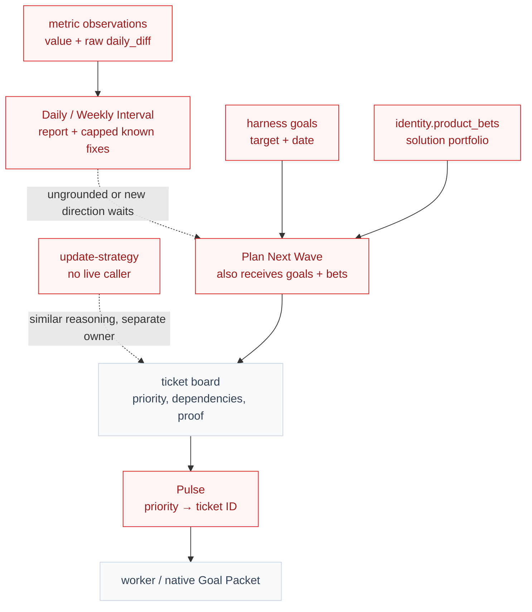
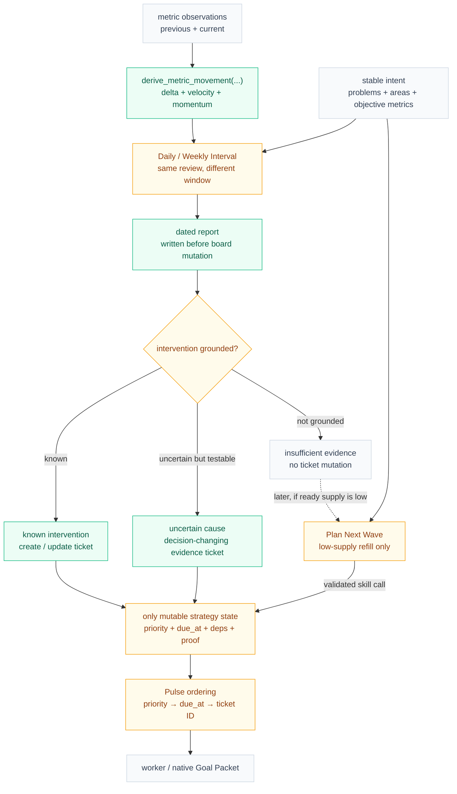
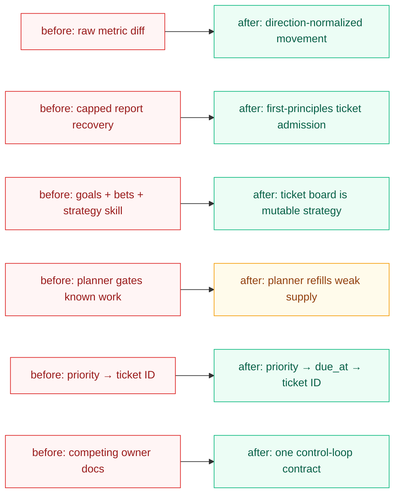

# Visual Plan

## Reading Order

- Start with `Before` to see why one feedback loop currently has several
  competing strategy owners.
- Check `After` to see the proposed metric-to-ticket control loop and the
  refill-only boundary.
- Use `What Changed` for the compact contract replacements.
- Give scope feedback against `Feedback Guide`; `ticket.md` remains canonical.

## Before: One feedback loop is split across several strategy surfaces

Metrics expose values and raw differences, while Interval is intentionally
report-first and maintenance-limited. Mutable direction is then repeated across
goals, product bets, an uncalled strategy skill, planner inputs, and tickets.

Legend:

- red = current problem, duplicated state, or behavior being replaced
- gray = canonical execution context that stays
- dashed edge = indirect, delayed, or unclear ownership

## After: Metric movement flows directly through Interval into proofable work

Stable intent constrains review and refill, but mutable strategy lives only on
the ticket board. Daily and Weekly use the same first-principles reasoning over
different evidence windows; Plan Next Wave remains a side-effect-free fallback
when the board needs refill and Interval lacks grounded work.

Legend:

- green = added derived capability, artifact, or direct admission path
- amber = changed owner, behavior, routing, or ordering
- gray = stable context or existing execution mechanism retained
- dashed edge = conditional later fallback, not a required hop

## What Changed

Diagram intent: compress the six implementation units into direct old-to-new
contract replacements.

Legend:

- red = retired or replaced contract
- green = new contract or capability
- amber = retained component with a narrower responsibility

## Short Notes

- Positive progress velocity always means favorable movement; `minimize`
  metrics invert the raw direction.
- Ticket admission requires materiality, executability, concrete proof, and no
  active duplicate; there is no numeric ticket cap.
- An investigation ticket is an outcome ticket only when it must reproduce the
  cause, rule out alternatives, select a correction, and emit proof.
- `due_at` is delivery timing, `priority` is importance, and
  `Reward.check_in_at` remains outcome-evaluation timing.
- Native Goal mode and ticket Goal Packets stay intact; only the project-level
  `goals` array is retired.

## Feedback Guide

- Does `Before` honestly show the latency and duplicate ownership being removed?
- Does `After` make it clear that Interval writes its report before ticket
  mutation?
- Is the boundary between same-run Interval admission and later low-supply
  refill unambiguous?
- Are metric direction, investigation outcomes, deadline ordering, and native
  Goal preservation represented correctly?
- Is any replacement in `What Changed` missing, unnecessary, or scoped
  incorrectly?
- Does any requested scope correction need to go back into canonical
  `ticket.md`?
