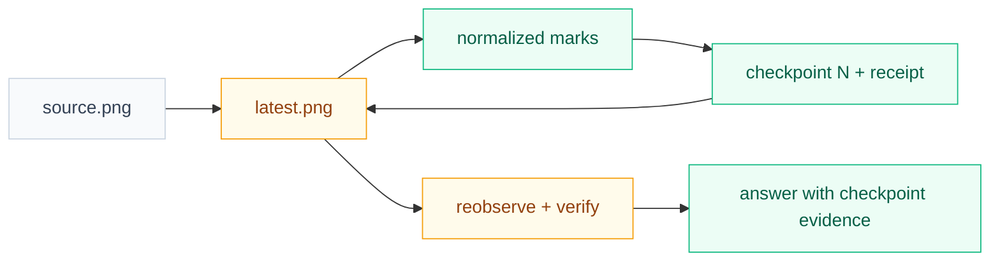
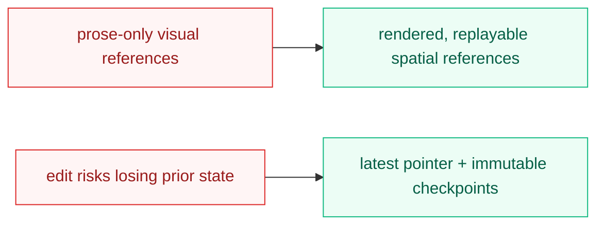

# Visual Plan

## Reading Order

- `Before` shows the reference-memory gap.
- `After` shows the checkpointed edit loop.
- `What Changed` compresses the ownership delta.

## Before: Visual reasoning disappears into prose

The agent repeatedly inspects an unchanged image and must remember linguistic
references without a durable spatial scratchpad.

Legend: gray is retained input; red is the current fragile path.

## After: Latest image advances while checkpoints stay recoverable

The agent edits the latest deterministic view, reobserves it, and can revise
without destroying any earlier state.

Legend: gray is immutable input; amber is updated current state; green is new
capability or evidence.

## What Changed

## Feedback Guide

- Is the immutable-checkpoint/latest-pointer split clear?
- Does any proposed operation exceed the simple first version?
- Should a heavy CV adapter remain deferred until a real failure case demands it?
