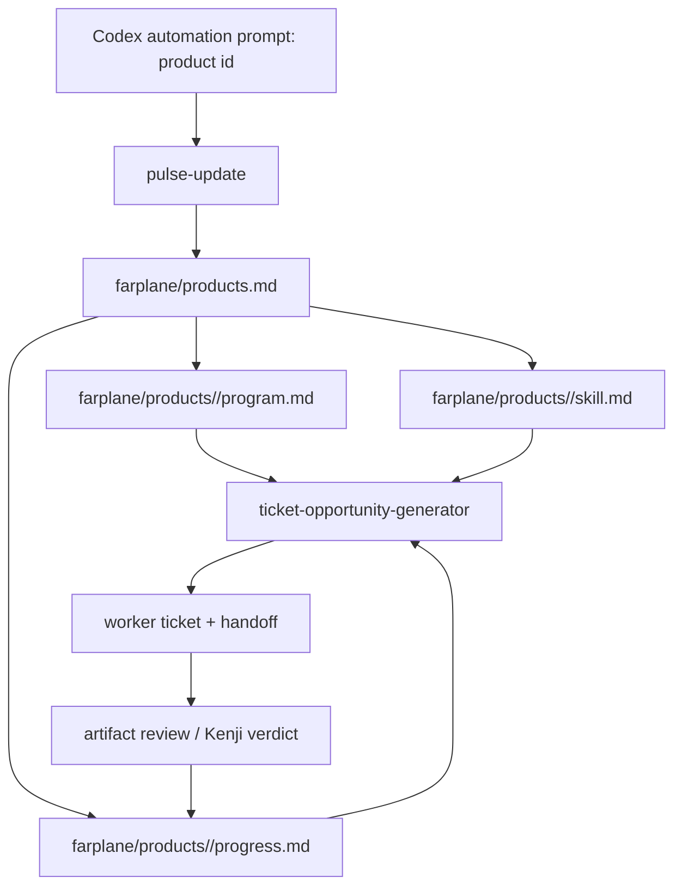
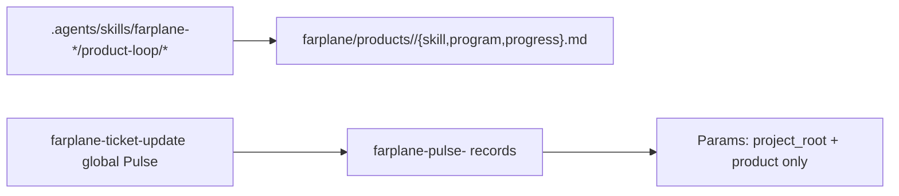

# TASK-0309 Visual Companion

This companion is non-blocking. The canonical approval contract is
`tickets/TASK-0309/ticket.md`.

```mermaid
flowchart TD
  A["Codex automation prompt: product id"] --> B["pulse-update"]
  B --> C["farplane/products.md"]
  C --> D["farplane/products/<id>/program.md"]
  C --> E["farplane/products/<id>/skill.md"]
  C --> F["farplane/products/<id>/progress.md"]
  D --> G["ticket-opportunity-generator"]
  E --> G
  F --> G
  G --> H["worker ticket + handoff"]
  H --> I["artifact review / Kenji verdict"]
  I --> F
```

```mermaid
flowchart LR
  Old[".agents/skills/farplane-*/product-loop/*"] --> New["farplane/products/<id>/{skill,program,progress}.md"]
  Legacy["farplane-ticket-update global Pulse"] --> ProductPulse["farplane-pulse-<product> records"]
  ProductPulse --> Param["Params: project_root + product only"]
```
