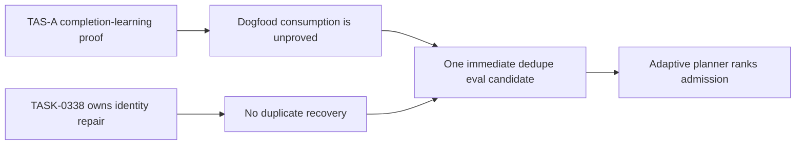

# Admit one Dogfood dedupe eval; create no recovery work

## Decision

No canonical experiment Goal Packet was active or pending at the cutoff. Admit
one immediate, report-only candidate to prove that Dogfood consumes
completion-learning output once without creating a duplicate recovery or
experiment ticket. Do not create ticket-identity recovery work: `TASK-0338`
already owns that failure.

## Situation map

## Material findings

| Finding | Why it matters | Evidence |
| --- | --- | --- |
| Active experiment WIP is `0`; one immediate slot is available. | A focused non-conflicting eval can be proposed without breaching portfolio limits. | Source capacity receipt; [normalized receipt](dogfood-receipt.json) |
| `TASK-0334` and archived `TASK-0335` have strong completion-learning proof. | The missing behavior is consumption and dedupe, not another learning pipeline. | Source reward/proof review |
| The selected candidate is a Dogfood fixture that consumes `ticket_output` once. | It directly tests the weekly review's highest-value unproved guard. | Source transfer candidate and ranked candidate 1 |
| Duplicate ticket identity is already owned by `TASK-0338`. | New recovery work would duplicate an active owner and distort supply. | Source rejected patterns and board finding |
| Future Reward rows belong to Pulse check-ins, not Dogfood decisions. | Dogfood must not score, mutate, or force terminal decisions for those rows. | Source due-check-in section |
| Feature posture is `FEAT-0070 adjust`, `FEAT-0071 continue with blocker`, `FEAT-0068 adjust`, and `SYS-0007 continue`. | The portfolio needs a narrow Dogfood guard, not a broad lifecycle or Pulse rewrite. | Source reward, proof, and feature review |

## Risks and unknowns

- Completion-learning reports are not indexed on Dogfood's normal read path, so
  the proposed fixture must include retained report and projected-ticket shapes.
- The active `TASK-0335` copy is stranded by duplicate archive identity; this is
  a board-health blocker, not experiment WIP.
- Daily reports for July 9–10, UI usage/agent-hour metrics, and the human-feedback
  export are missing. Do not infer productivity or admit a human-feedback
  experiment from this snapshot.
- This is the first portfolio-shaped scheduled report after feature-review
  reports; recurrence and planner consumption remain unproved.
- Defer Paperclip parity work until a gap report isolates one missing Farplane
  behavior and proof route; the current source is report-only and duplicative.

## Next action

- **Owner / action:** the adaptive planner may rank and admit the Dogfood
  completion-learning dedupe fixture as a normal immediate experiment packet.
- **Proof:** a focused replay shows one consumption of `ticket_output`, zero
  duplicate recovery tickets when `TASK-0338` exists, zero experiment tickets
  created by Dogfood, and no reward/check-in mutation. Stop before any write if
  the assertions fail.

## Supporting evidence

- [Normalized machine receipt](dogfood-receipt.json) — authority, mutations,
  ordering/capacity guards, and exact no-execution stop state.
- [Source report](../../../../../.farplane/reports/dogfood-review/2026-07-13T060328+0800.md)
  — exhaustive ledgers, feature review, source gaps, and receipts.
- [Comparison](comparison.md) — retained, moved, and removed content plus
  reading-path measurements.

This is a ticket-local rendering prototype. It does not replace the source
report or change the live Dogfood producer.
