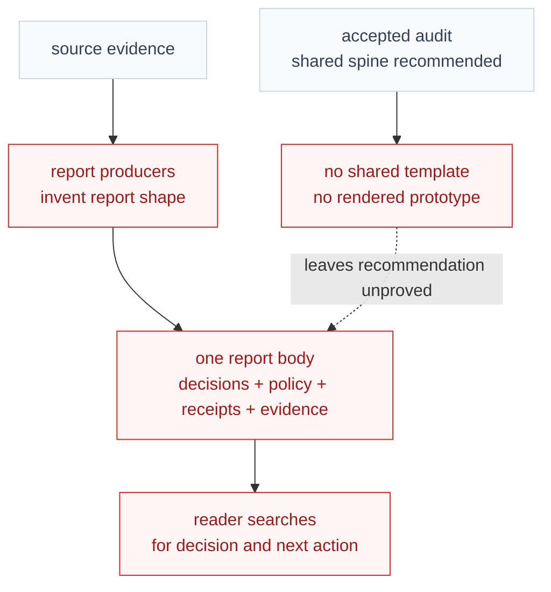
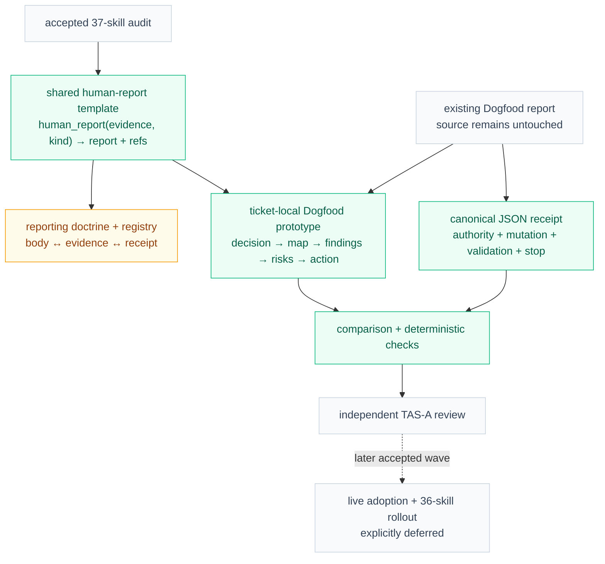
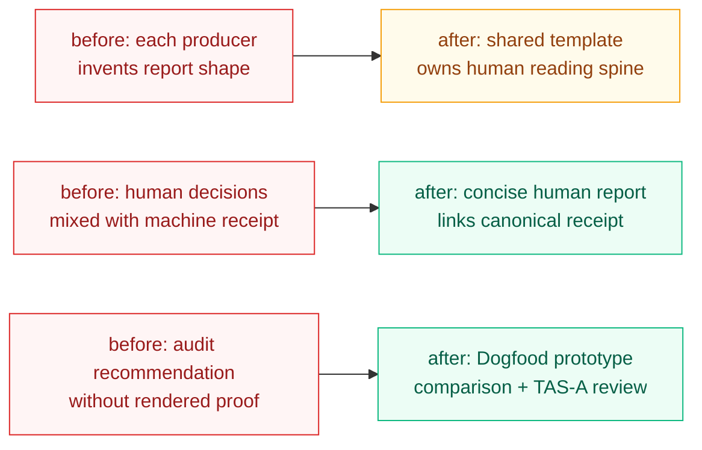

# Visual Plan

## Reading Order

- Start with `Before` to see why current reports are difficult to scan.
- Check `After` to see the bounded template-and-prototype proof path.
- Use `What Changed` for the compressed old-to-new summary.
- Give feedback against `Feedback Guide`.

## Before: Human decisions and machine proof compete in the same report

Report producers currently invent their own shapes and mix several audiences in
one body. The accepted audit identifies a shared reading spine, but there is no
reusable template or rendered proof yet.

Legend:

- red = current problem, missing owner, or unproved recommendation
- gray = existing evidence or accepted context that stays

## After: One template proves a decision-first report without changing live producers

The shared template owns the human reading spine while supporting proof stays
linked and canonical. One Dogfood prototype tests the boundary against real
evidence before any live skill or broad rollout changes.

Legend:

- green = added template, prototype, receipt, or proof artifact
- amber = changed doctrine, ownership, or discoverability
- gray = accepted input, unchanged source, review, or deferred scope

## What Changed

Diagram intent: show the two bounded replacements this prototype must prove.

Legend:

- red = current or unproved behavior being replaced
- amber = changed ownership or reporting boundary
- green = added human-readable or proof artifact

## Short Notes

- `ticket.md` remains the canonical scope and approval contract.
- The source Dogfood report and all live report-producing skills remain unchanged.
- The prototype must retain every material decision, risk, gap, next action, and
  no-execution proof across the human report or linked receipt.
- Broad rollout is a later decision; this ticket proves only the first
  representative slice.

## Feedback Guide

- Is the before diagram honest about the mixed-audience report problem?
- Is the human-body versus canonical-receipt boundary clear in the after diagram?
- Does the bounded Dogfood prototype prove the pattern without implying live rollout?
- Are the colored boxes enough to scan what changed even with the legends alone?
- Is there a scope change that must go back into `ticket.md`?
