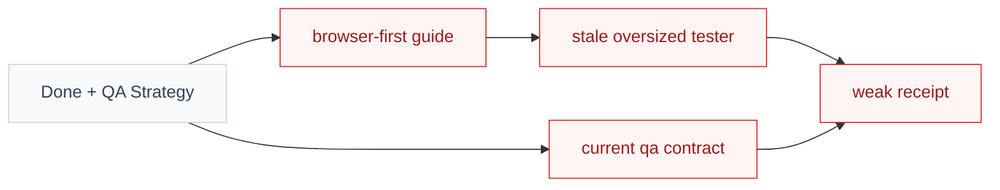
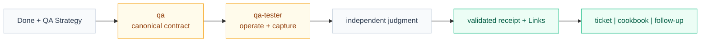
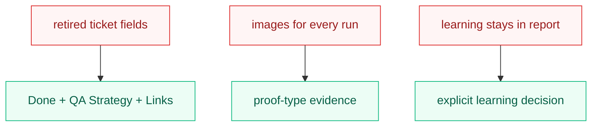

# Visual Plan

## Before: duplicated QA contracts drift

Legend: red = drift; gray = retained canonical context.

## After: one contract drives the complete journey

Legend: amber = changed owner; green = added capability; gray = retained boundary.

## What Changed

## Feedback Guide

- Is `qa` the single contract owner?
- Does the tester retain hard gates without duplicating recipes?
- Is shared learning selective and durable?
