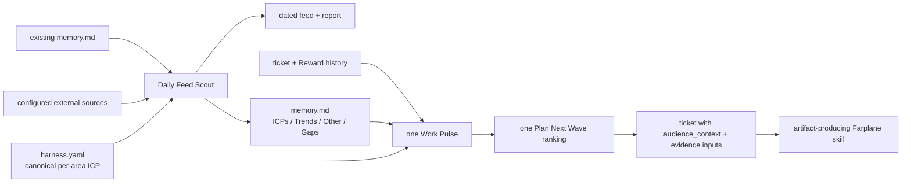

# TASK-0369 Visual Companion

The Markdown memory is mutable current synthesis, not an append-only trend
timeline. `harness.yaml` remains canonical for ICP meaning; the memory adds
observed concerns, vocabulary, trends, and notable evidence with source refs.
