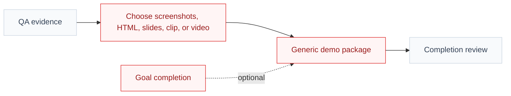
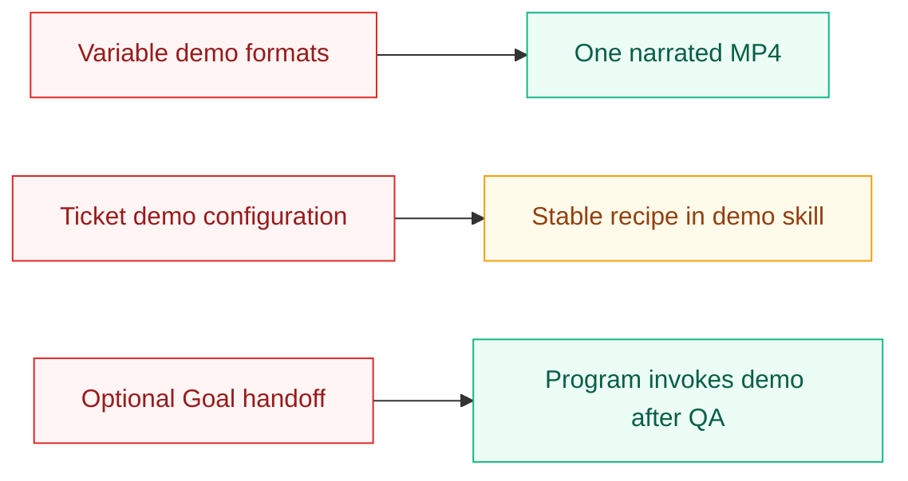

# Visual Plan

## Reading Order

- `Before` shows the ambiguous demo output and missing Goal handoff.
- `After` shows the single owner and completion sequence.

## Before: Demo format and invocation vary by ticket

Legend:

- Red = ambiguous or unreliable behavior.
- Gray = existing evidence/review flow that stays.

## After: Demo owns one evidence-grounded recap

```mermaid
flowchart LR
  classDef keep fill:#f8fafc,stroke:#cbd5e1,color:#334155
  classDef added fill:#ecfdf5,stroke:#10b981,color:#065f46
  classDef changed fill:#fffbeb,stroke:#f59e0b,color:#92400e

  goal["Material implementation Goal"]:::keep --> qa["QA pass"]:::keep
  qa --> demo["demo(ticket, passed_qa)"]:::changed
  demo --> plan["Ticket-scoped content plan"]:::added
  plan --> mp4["Narrated MP4 + evidence map"]:::added
  mp4 --> review["TAS-A completion review"]:::keep
  review --> close["Close ticket"]:::keep
```

Legend:

- Amber = changed owner or behavior.
- Green = new artifact or capability.
- Gray = canonical lifecycle steps retained.

## What Changed

## Feedback Guide

- Is `demo` clearly the sole recipe owner?
- Is the lifecycle visibly `QA → demo → review → close`?
- Are direct non-Goal changes correctly outside the new path?
